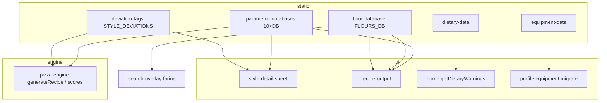

# Database parametrici e dati
> Aggiornamento: 2026-06-23 | Stato: ✅ | File documentati: 5

## Sommario

Layer dati statici che alimentano motore, configuratore, profilo e contenuti esplorativi: **10 tabelle parametriche per stile** (`parametric-databases.ts`), **catalogo farine** con W/P/L (`flour-database.ts`), **attrezzatura** con migrazione legacy e i18n CMS (`equipment-data.ts`), **vincoli dietetici** con modelli FODMAP/istamina (`dietary-data.ts`) e **tassonomia deviazioni** per E-Score (`deviation-tags.ts`).

Fonte dichiarata nel codice: export Notion (marzo 2026). I DB parametrici coprono **15 `styleId`** allineati a `STYLES_DB` in `pizza-engine.ts` (mancano voci solo dove uno stile non ha riga in una tabella specifica).

## File chiave

| File | Righe (circa) | Ruolo |
|------|----------------|--------|
| `src/app/data/parametric-databases.ts` | 344 | 10 DB + lookup per `styleId`; `getStyleParametrics()` aggrega tutto |
| `src/app/data/flour-database.ts` | 619 | `FLOURS_DB` (25 farine), helper W/stile/suggerimento |
| `src/app/data/equipment-data.ts` | 385 | Mixer, superfici, utensili; `EquipmentState`, migrazione, localizzazione CMS |
| `src/app/data/dietary-data.ts` | 138 | Warning contestuali FODMAP/istamina/gluten-free/nickel localizzati via CMS |
| `src/app/domain/deviation-tags.ts` | 372 | `STYLE_DEVIATIONS`, tag multi-dimensionali; rimosso `AUTHOR_VARIANTS` migrato in `interpretation-library.ts` |

**Consumatori principali:** `pizza-engine.ts` (`STYLE_DEVIATIONS`, `getToppingByStyle`), `recipe-output.tsx` (parametriche in output), `style-detail-sheet.tsx`, `engine-test-suite.tsx`, `explore.tsx`, `recommended-styles.tsx`, `search-overlay.tsx`, `home.tsx` (`getDietaryWarnings`), `profile.tsx` (equipment), `recipe-configurator.tsx` (tipo `FlourEntry`).

## Flusso dati

1. **Parametriche per stile:** `getToppingByStyle(style.id)` → `topping_info` e tip in `generateRecipe` / `generateTips`. `getStyleParametrics(id)` usato in sheet stile e test suite.
2. **Farine:** `suggestFlours(styleId, recipeW, hours)` e `getCompatibleFlours` restano API dati per UX/search; il motore usa W da stile/override, non legge direttamente `FLOURS_DB` in generazione grammi.
3. **Equipment:** profilo salva `vulcan_equipment` → `use-profile-defaults` → flag `has_mixer`, `has_pizza_stone`, ecc. in `UserConstraints` → `recommendStyles` / feasibility.
4. **Dietary:** profilo salva `vulcan_dietary` → constraints → warning su home quando si genera anteprima; logica FODMAP anche in digestibility del motore (capitolo `pizza-engine`).
5. **Deviazioni:** ogni stile ha `deviation_score` 0–1; motore calcola `deviation_score_effective` per experimentation score.

## Funzioni principali

### `parametric-databases.ts`

| Export | Scopo |
|--------|--------|
| `getOvenTempByStyle` … `getEquipmentByStyle` | Lookup singola tabella parametriche |
| `getStyleParametrics(styleId)` | Oggetto aggregato con tutte le 10 slice per uno stile |

**Interne/Locali**: `OVEN_TEMPS_DB`, `BAKING_TIMES_DB`, `DOUGH_BASE_DB`, `SALT_DB`, `WATER_DB`, `MATURATION_DB`, `TOPPING_DB`, `FOLDING_DB`, `SCORING_DB`, `EQUIPMENT_DB` (non più esportati direttamente).

### `flour-database.ts`

| Export | Scopo |
|--------|--------|
| `getCompatibleFlours(styleId)` | Filtra `stili_compatibili` |
| `suggestFlours(style, recipeW, hours, maxResults)` | Ranking stile + distanza W + finestra fermentazione |
| `getEffectiveWRange(flour)` | W ± batch ± stagione (audit DB Engineer) |

**Rimossi nell'allineamento**: `getFloursByProducer` e `getFloursByWRange` (rimossi poiché ridondanti e non utilizzati).

### `equipment-data.ts`

| Export | Scopo |
|--------|--------|
| `migrateEquipment(saved)` | Vecchio formato boolean → `mixer_type` / `surfaces` |
| `syncLegacyFlags(state)` | Deriva `mixer`, `pizza_stone`, … da stato avanzato |
| `getLocalizedMixerOptions/SurfaceOptions/ToolOptions` | Override label da `CmsContent` profilo |

### `dietary-data.ts`

| Export | Scopo |
|--------|--------|
| `getDietaryWarnings(filters, params, cms?)` | Avvisi e raccomandazioni contestuali basati sui parametri ricetta corrente |

**Interne/Locali**: `calculateFodmapReduction` (riduzione %, cap 95%), `calculateHistamine` (accumulo mg/kg stimato).
**Rimossi nell'allineamento**: `detectDietaryConflicts`, `DIETARY_INFO`, `getLocalizedDietaryInfo` (rimossi e delegati al motore o al CMS).

### `deviation-tags.ts`

| Export | Scopo |
|--------|--------|
| `getStyleDeviation(styleId)` | `DeviationSignature` (default canonico se assente) |
| `getStyleTags(styleId)` | `RecipeTags` multi-asse |

## Costanti e configurazione

| Costante | Valore / note |
|----------|----------------|
| Stili in DB parametrici | 15 id (es. `napoletana_stg`, `teglia_romana`, `detroit`, …) |
| `FLOURS_DB` | 25 entry `FlourEntry` (categorie: grano_tenero, manitoba, semola, integrale, gluten_free, speciale) |
| `MIXER_OPTIONS` | 5 tipi; `frictionK` / `frictionDegMin` per Regola 55 (collegamento motore; emoji di `stand_domestic` aggiornata da 🍳 a 🥣 per precisione visiva) |
| `STYLE_DEVIATIONS` | Record per ogni stile in `STYLES_DB`; score 0.0 (canonico) – 0.55 (ibrido) |
| `DEFAULT_EQUIPMENT` | Stato vuoto; flag legacy false |

Chiavi localStorage correlate (capitolo `profile-user`): `vulcan_equipment`, `vulcan_dietary`, `vulcan_pantry`.

## Guard rail e vincoli

- **Allineamento stile:** lookup parametrici restituiscono `undefined` se `styleId` sconosciuto; UI deve gestire assenza (sheet/test suite).
- **FODMAP vs istamina:** `getDietaryWarnings` produce avvisi contestuali localizzati; il compromesso operativo 8–12h @ 18°C è documentato nei testi CMS/domain defaults, non in un resolver di conflitti separato.
- **GF:** `getDietaryWarnings` con `gluten_free` attivo emette sempre `critical` su ricetta a grano — invito a mix GF.
- **Equipment legacy:** `migrateEquipment` mappa `mixer: true` → `stand_domestic`; profilo FTU salva anche `mixers_owned[]` oltre a `mixer_type` primario.
- **Farine GF:** `suggestFlours` esclude `w === 0` dal ranking normale; la UI deve evitare di proporre mix GF come sostituti diretti di farine W tradizionali.
- **Duplicazione dominio:** `deviation-tags` e `parametric-databases` sono già referenziati nel capitolo `pizza-engine`; questo capitolo è la fonte dati, non la logica di calcolo.
- **Rimozione Varianti Autore (`deviation-tags.ts`)**: Il database legacy `AUTHOR_VARIANTS` e la funzione `getCompatibleVariants()` sono stati interamente rimossi e sostituiti con `getInterpretationsForStyle()` caricato da `interpretation-library.ts` come singola fonte di verità.
- **Pulizia dead code 2026-06-19:** `flour-suggestion-card.tsx` è stato rimosso; la fonte documentata resta `flour-database.ts`, consumata da search/output/configurazione dove necessario.

## Prossimi Sviluppi & Integrazioni Pianificate

I database parametrici strutturati tracciano le seguenti espansioni future pianificate nel backlog (rif. `VPL-018`):

- **Modello Termico "Cabbage Shield" (`anguli_cibudda`)**: Modellazione dell'interazione fisica delle foglie di verza in `calculateOvenCompensations()`. La verza agisce da scudo termico a bassa conducibilità ($k \approx 0.15\ W/mK$), riducendo l'energia assorbita dal fondo della pizza in cottura e richiedendo step dedicati in `BAKING_TIMES_DB`, `OVEN_TEMPS_DB` ed `EQUIPMENT_DB`.
- **Dati Ingredienti Farine Alternative**: il catalogo include già riso, mais, grano saraceno, avena, teff e ceci; resta aperta l'eventuale mappatura di soia e blend regionali specifici.

## Bug noti e fix

- Commento in testa a `dietary-data.ts` cita ancora `getLocalizedDietaryInfo/Conflicts`, ma gli export reali sono `DietaryWarning` e `getDietaryWarnings`.
- `use-profile-defaults` legge solo flag legacy equipment se manca `mixer_type`; profilo FTU può salvare `mixers_owned` senza popolare tutti i campi avanzati in `UserConstraints` (gap VPL-067 parziale).
- Nessun bug funzionale documentato nel codice per i DB parametrici; `engine-test-suite` importa le 10 tabelle per regressioni.
