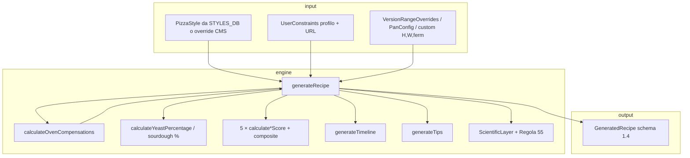

# Motore pizza e ricetta
> Aggiornamento: 2026-07-01 | Stato: ✅ | File documentati: 6

## Sommario

`pizza-engine.ts` (4979 righe) è il nucleo di dominio di Vulcan: tipi, database di **28 stili pizza** (`STYLES_DB`), generazione parametrica della ricetta (`generateRecipe`), motore di compensazione forno, cinque dimensioni di score, timeline operativa, layer scientifico (Q10, P/L, Regola 55) e raccomandazione stili (`recommendStyles`). Il file esporta **59 simboli pubblici** (dopo la pulizia delle esportazioni interne inutilizzate); è importato dai moduli UI di ricetta, home, profilo, score, stili, CMS e dev.

Allineamento audit: commenti in testa e nel codice riferiscono *Audit Verifica Implementativa v1* (feb 2026) e fix successivi (ADV-02, ADV-04, ADV-08, ADV-11). Schema ricetta versione **1.4** (`RECIPE_SCHEMA_VERSION`).

## File chiave

| File | Righe (circa) | Ruolo |
|------|----------------|--------|
| `src/app/domain/pizza-engine.ts` | 4979 | Motore completo: tipi, DB (28 stili), generazione, score, timeline, preset |
| `src/app/features/dev-tools/engine-test-suite.tsx` | 1784 | Suite dev VPL-073: asserzioni dinamiche su `STYLES_DB` e score |
| `src/app/domain/deviation-tags.ts` | 372 | `STYLE_DEVIATIONS`, `STYLE_TAGS`, `DEVIATION_CATEGORY_LABELS` per E-Score |
| `src/app/data/topping-library.ts` | ~2100 | Libreria topping: 34 concetti, 40 ricette, autenticità per stile e timeline injection (integrati nuovi topping premium Wave 1 e Wave 2) |
| `src/app/data/impasto-library.ts` | ~320 | Libreria impasti riusabili: 7 metodi (rimossi gli helper inutilizzati `getAllImpasti` e `getImpastiCompatibleWith`) |
| `src/app/data/parametric-databases.ts` | — | `getToppingByStyle(style.id)` → `topping_info` e tip in `generateRecipe` / `generateTips` |

**Consumatori principali** (capitolo `recipe-flow` / altri): `recipe.tsx`, `recipe-configurator.tsx`, `recipe-output.tsx`, `home.tsx`, `profile.tsx`, `recommended-styles.tsx`, `style-editor-tab.tsx`, `recipe-match-card.tsx`, `styles-override-context.tsx`, `use-profile-defaults.ts`, `dev-tools.tsx`, `explore.tsx`, `search-overlay.tsx`.

## Flusso dati

**`recommendStyles`**: per ogni stile in `STYLES_DB` (o `stylesOverride`) calcola punteggio compatibilità pesato (tempo 25%, forno 25%, skill 20%, attrezzatura 10%, dispensa 20%) → `StyleRecommendation[]` ordinato.

**i18n messaggi motore**: penalità/warning/claim usano `EngineMsg` (`key`, `fallback`, `params`); `resolveEngineMsgs` applica template CMS nei consumatori ricetta/output e nei blocchi tecnici.

## Funzioni principali

| Funzione / export | Scopo |
|-------------------|--------|
| `generateRecipe` | Entry point: grammi, score, timeline, science, topping; prende `GenerateRecipeOptions` (options object) per evitare swaps accidentali |
| `calculateOvenCompensations` | Δ idratazione (log), olio/zucchero, tempo cottura (exp), thickness factor |
| `getQ10` | Q10 per lievito/temperatura (`standard` / `cold_adapted` / `sourdough`) |
| `estimatePL` | P/L da W clampato nel range stile |
| `calculateAuthenticityScore` | [Interna] Assi ingredienti/processo/attrezzatura/forma + penalità `EngineMsg` |
| `calculateFeasibilityScore` | [Interna] Forno 40%, farina W 30%, skill×idratazione 30% |
| `calculateDigestibilityScore` | [Interna] Ore equivalenti 18°C, FODMAP stimato, claims |
| `calculateExperimentationScore` | [Interna] Deviazione stile + parametri + conteggio compensazioni |
| `calculateSustainabilityScore` | [Interna] Energia forno, tempo cottura, fermentazione, ingredienti, lievito |
| `recommendStyles` | Ranking stili per vincoli utente |
| `resolveEngineMsgs` | Localizzazione messaggi motore |
| `defaultFermentTempC` | Temperatura di fermentazione di default style-aware |
| `thermalViability` | Calcolo compatibilità termica dello stile col forno |
| `calcDoughWeight` / `getDefaultShapeArea` | [Interne] Peso impasto da teglia custom / area |
| `getServingUnit`, `getServingsRange`, `getDefaultDoughBalls` | UX porzioni |
| `isFillingStyle` | Restituisce true se lo stile della pizza prevede una farcitura o un layout chiuso/sdoppiato (es. calzone, spaccata, baciata). |
| `supportsThickness`, `needsPan`, `defaultPanShape` | UI configuratore teglia |
| `generateTimeSlots` | Slot pasto per wizard tempo |
| `outdoorToKitchenTemp` | Modello T cucina da T esterna (VPL-066) |
**Interne rilevanti**: `DEFAULT_LAYOUT`, `calculateYeastPercentage`, `generateTimeline`, `generateTips`, `_calculateEffectiveDeviation`, `_getStyleDeviationScore`, `classifyScore`, `MIXER_FRICTION_K` (Regola 55).

## Costanti e configurazione

| Costante | Valore / contenuto |
|----------|-------------------|
| `STYLES_DB` | **28 stili** — storici (15): `napoletana_stg`, `napoletana_canotto`, `teglia_romana`, `tonda_romana`, `pinsa_romana`, `new_york`, `detroit`, `chicago_deep`, `bonci_teglia`, `focaccia_genovese`, `sfincione`, `pala_romana`, `grandma_style`, `focaccia_recco`, `padellino_torino` — Sprint 11 (2): `pizza_baciata`, `ciaccino_senese` — Audit 2026 italiani (6): `trancio_milanese`, `focaccia_barese`, `pizza_fritta`, `calzone_napoletano`, `pizza_al_metro`, `pizza_spaccata` — Audit 2026 internazionali (5): `new_haven_apizza`, `fugazzeta`, `california_style`, `greek_pan`, `chicago_tavern` |
| `PIZZA_FAMILIES` | 4 famiglie: napoletana, romana, americana, contemporanea |
| `SCORE_DIMENSIONS` | Pesi composite default: Aut 30%, Fat 25%, Dig 20%, Sos 15%, Spe 10% |
| `FLOUR_W_RANGES` | Tipi dispensa + farine brand (Caputo, Petra, 5 Stagioni, …) |
| `OVEN_PRESETS` | `home` 250°C … `wood` 500°C |
| `SKILL_LEVELS` | 1–4 con etichette UI |
| `YEAST_LABELS` | fresh / dry / sourdough |
| `SERVING_UNIT_LABELS` | panetto, teglia, pala, padellino, focaccia |
| `DEFAULT_KITCHEN_TEMP` | 21 °C |
| `RECIPE_SCHEMA_VERSION` | `"1.4"` |
| `TIME_SLOTS` / `NO_PREFERENCE_SLOT` | [Interne] Target pasti statici + `generateTimeSlots` dinamico |

**Dipendenze import**: `./deviation-tags` (`STYLE_DEVIATIONS`, `STYLE_TAGS`), `./parametric-databases` (`getToppingByStyle`).

**Override in `generateRecipe`**: `ScoreWeightsOverride`, `RecWeightsOverride` (solo `recommendStyles`), `VersionRangeOverrides` (range idratazione/W/P-L/fermentazione/peso).

## Guard rail e vincoli

- **Range invertiti**: `safeRange` normalizza `[min,max]` se lo Style Editor produce inversione temporanea.
- **Fermentazione vs tempo disponibile**: clamp a `available_hours` solo se `customFermentationHours` non è impostato (rispetta versioni tipo “48h”).
- **Compensazioni olio/zucchero**: applicate solo se `style.allows_additives` (stili rigidi es. STG non ricevono zucchero compensativo).
- **Forno**: `ovenTemp = min(oven_max_temp_c, temp_ideal)`; se sotto `temp_c_range[0]` usa `oven_max_temp_c` comunque → attiva compensazioni.
- **Lievito da dispensa**: priorità sourdough se fermentazione ≥24h o pre-fermento; fallback fresh/dry; sourdough con % impasto 15–20% (non baker % commerciale).
- **Fermentazione ≤2h**: cap lievito 0.01–0.5% (ADV-02, es. Focaccia di Recco).
- **Fermentazione ≤0h**: 0% lievito.
- **Ordinamento Rappresentativo dei Topping**: `getRecipesByAuthenticity` ordina i condimenti del carousel posizionando per primi la ricetta di default dello stile, seguita dai concetti più rappresentativi per rilevanza culturale (`REPRESENTATIVE_CONCEPT_ORDER_BY_STYLE` e `REPRESENTATIVE_CONCEPT_ORDER_BY_FAMILY`), e infine per autenticità e indice di sorgente.
- **Thumbnail Fallback**: Introdotto l'helper `getToppingThumbnail` per risolvere l'immagine del condimento, con fallback automatico a quella del concetto generale se la ricetta specifica ne è sprovvista.
- **Temperatura acqua (Regola 55)**: `T_acqua = DDT×3 − T_amb − T_farina − friction`; `null` se fuori 2–40 °C.
- **Burro Chicago**: `fat_type: "butter"`, `oil_g = 0`, `fat_g` da percentuale burro (~18%).
- **Interazione idratazione × skill**: calcolata in `calculateFeasibilityScore`. Idratazione >75% sconsigliata per principianti (skill 1). Per gli intermedi (skill 2) la soglia di warning sale a >85% (idratazione estrema).
- **Porzioni e default**: Pinsa romana supporta `servings_per_unit: [1, 1]` (formato monoporzione individuale ovale), Padellino di Torino imposta `default_dough_balls: 4` (individuali per default). Anche napoletana, napoletana_canotto, scrocchiarella hanno `servings_per_unit: [1, 1]` (pizza individuale).
- **Feasibility forno**: floor 5/10/20 per deficit estremo (>200°C / >100°C) — ADV-08.
- **Ripristino sale Napoletana STG**: Ripristinata la percentuale di sale al 2.8% (disciplinare AVPN) per lo stile Napoletana STG per salvaguardare l'autenticità dello stile-bandiera rispetto a uniformità arbitrarie.
- **Default fermentazione style-aware**: La funzione `defaultFermentTempC` gestisce la temperatura di default: per gli stili diretti a temperatura ambiente (`napoletana_stg`, `tonda_romana`) imposta 22°C anche a lunga lievitazione evitando la forzatura automatica del frigo (4°C), mentre gli altri stili mantengono il frigo sopra le 12 ore.
- **Viabilità termica (Thermal Viability)**: La funzione `thermalViability` verifica se l'efficacia termica del forno soddisfa lo stile ad alta temperatura (minimo >= 350°C o forno a legna richiesto). In caso di deficit, restituisce un moltiplicatore di penalità che riduce drasticamente l'Autenticità ed emette un warning di fattibilità (`feas.thermalUnviable`) riducendo la fattibilità complessiva.
- **Rinormalizzazione composite score a 5 pesi**: Il punteggio composite in `generateRecipe` somma tutti e 5 i pesi (`authenticity`, `feasibility`, `digestibility`, `sustainability`, `experimentation`) e normalizza dividendo per la loro somma totale, rimuovendo le distorsioni provocate da override specifici su sostenibilità o sperimentazione.
- **Trasparenza delle motivazioni dell'Optimizer**: In `optimizeRecipe`, le descrizioni dei motivi della ricetta ottimizzata (rationale) segnalano in modo esplicito le variazioni rispetto al midpoint canonico dello stile: la riduzione dell'idratazione include la percentuale canonica di confronto, le modifiche della farina W e l'aggiunta di pre-fermenti non richiesti dallo stile base sono tracciate come deviazioni dal default.
- **Ordinamento delle raccomandazioni per rankingScore**: In `recommendStyles`, la lista di raccomandazioni viene ordinata in base al `rankingScore` (che include l'iconic boost), con fallback a `compatibilityScore` per i pareggi. Questo allinea la logica di ranking con l'ordinamento reale visualizzato.
- **Rifattorizzazione options object per generateRecipe**: Per evitare bug di swap di parametri posizionali di tipo scalare simili, la firma di `generateRecipe` è stata convertita in un oggetto opzioni `options: GenerateRecipeOptions = {}` contenente tutti i parametri opzionali ed override.
- **F7 allineamento no-knead**: Rimosso il malus di `-8` in `glutenNetwork` per i processi no-knead. Poiché l'autolisi prolungata e le pieghe (stretch & fold) a intervalli sviluppano una maglia glutinica eccellente, il no-knead riceve ora `kneadBonus: 3` (rispetto a `5` dell'impasto lavorato standard), non venendo più ingiustamente penalizzato.

### STYLES_DB — Correzioni Audit Maggio/Giugno 2026

Valori rettificati da fonti autorevoli (disciplinari IGP/APITER, Consultapizza, PizzaBlab/PizzaLogic):

| Stile | Campo | Vecchio | Nuovo | Fonte |
|-------|-------|---------|-------|-------|
| `teglia_romana` | `flour_w_range` | [280, 340] | [300, 360] | Disciplinare APITER |
| `teglia_romana` | `flour_pl_range` | [0.50, 0.70] | [0.50, 0.60] | APITER |
| `tonda_romana` (scrocchiarella) | `flour_w_range` | [180, 240] | [170, 230] | La Verace, Molino Vigevano |
| `tonda_romana` | `hydration_pct_range` | [55, 62] | [55, 60] | audit |
| `detroit` | `sugar_pct` | 1.0% | 0.5% | PizzaBlab, PizzaLogic |
| `sfincione` | `hydration_pct_range` | [65, 70] | [60, 70] | tradizione palermitana (giu 2026: era [68,75]) |
| `sfincione` | `flour_w_range` | [250, 300] | [240, 280] | tradizione palermitana (giu 2026) |
| `pala_romana` | `oil_pct` | 1.5% | 2.5% | Consultapizza |
| `pala_romana` | `hydration_pct_range` | [70, 80] | [75, 82] | Consultapizza (giu 2026) |
| `pala_romana` | `fermentation_hours_range` | [24, 72] | [18, 48] | audit |
| `pala_romana` | `process_type` | `"biga\|poolish"` | `"direct\|biga\|poolish"` | può essere diretta |
| `pala_romana` | `requires_pre_ferment` | `true` | `false` | può essere diretta |
| `focaccia_recco` | `flour_w_range` | [280, 360] | [300, 340] | Disciplinare IGP (giu 2026: era [170,210] errato) |
| `focaccia_recco` | `flour_pl_range` | [0.40, 0.55] | [0.55, 0.70] | IGP: sfoglia richiede farina forte |
| `focaccia_recco` | `hydration_pct_range` | [45, 52] | [45, 50] | IGP (giu 2026) |
| `chicago_deep` | `hydration_pct_range` | [48, 56] | [48, 52] | audit (giu 2026) |
| `chicago_deep` | `flour_w_range` | [230, 290] | [220, 260] | audit (giu 2026) |
| `bonci_teglia` | `hydration_pct_range` | [78, 95] | [80, 90] | corsi pro Bonci (giu 2026) |
| `bonci_teglia` | `flour_w_range` | [280, 350] | [300, 340] | corsi pro Bonci (giu 2026) |
| `focaccia_genovese` | `hydration_pct_range` | [60, 72] | [55, 62] | tradizione genovese (giu 2026) |
| `focaccia_genovese` | `flour_w_range` | [200, 260] | [240, 280] | tradizione genovese (giu 2026) |
| `grandma_style` | `hydration_pct_range` | [60, 66] | [60, 65] | italo-americana (giu 2026) |
| `grandma_style` | `flour_w_range` | [260, 320] | [240, 280] | italo-americana (giu 2026) |
| `padellino_torino` | `hydration_pct_range` | [65, 75] | [60, 65] | tradizione torinese (giu 2026) |
| `padellino_torino` | `flour_w_range` | [260, 320] | [220, 260] | tradizione torinese (giu 2026) |

> ⚠️ La correzione `focaccia_recco` resta una delle più rilevanti: il W è stato riallineato al disciplinare IGP impattando il feasibility score e la selezione farine.
- **Idratazione custom**: non somma Δ compensazione idratazione.

## Bug noti e fix

| ID / nota | Stato | Dettaglio |
|-----------|--------|-----------|
| Chicago burro vs olio | ✅ Fix | `chicago_deep`: `fat_type: "butter"`, `oil_pct: 18` (era 0 olio) |
| Lievito focaccia breve | ✅ ADV-02 | `fermentationHours ≤ 2` → max 0.5% invece di blow-up Arrhenius |
| Pre-fermento tipo | ✅ ADV-04 | `process_type` `biga\|poolish` → primo match biga/poolish |
| Score forno impossibile | ✅ ADV-08 | Deficit >200°C → `ovenScore` floor 5 |
| Sourdough teglia lunga | ✅ ADV-11 | Sourdough anche per ferment ≥24h senza solo `requires_pre_ferment` |
| Q10 fisso 2.0 | ✅ Fix | `getQ10` variabile per T e tipo lievito |
| Idratazione compensazione lineare | ✅ Fix | Modello logaritmico in `calculateOvenCompensations` |
| k tempo cottura | 🟡 Calibrato | `k=0.0065`; commento: fit esponenziale imperfetto su tutto il range |
| Deviation signature E-Score | 🟡 Parziale | `calculateExperimentationScore` usa deviazioni; Notion Pag.08 TODO ancora citato in commento |
| `_calculateEffectiveDeviation` | 🟡 MVP | Implementato in 1.4; commento “Notion Pag.04 TODO” residuo |

**Test**: `engine-test-suite.tsx` (1783 righe, pagina dev) esegue asserzioni dinamiche su tutti gli stili, Q10, compensazioni, score, schema version — utile regressione manuale, non CI automatica nel repo. Lo Sprint 12/Audit Giugno 2026 introduce la categoria "Optimizer" (T13) con 8 test case di regressione (midpoint optimization, available hours, beginner limit, ordinamento alternative, rationale e verifiche per F4/F1).

## Tipi dati essenziali

- **`PizzaStyle`**: identità stile + `dough` / `shape` / `baking` + flag (`requires_wood_oven`, `allows_additives`, …) + campi UX opzionali: `image?`, `serving_unit?: ServingUnit`, `default_dough_balls?: number`, `servings_per_unit?: [number, number]`, `layout?: LayoutSpec` e `default_topping_ref?: string`.
- **`LayoutType`**: `"single" | "stacked" | "closed_stuffed" | "folded_layers" | "double_thin_sheet"` — struttura geometrica dell'impasto (Sprint 11).
- **`LayoutSpec`**: `{ type: LayoutType, pieces_per_unit?: number, interlayer?: string, filling_timing?: string, cook_mode?: string, folds?: number }` — specifica geometrica dello stile.
- **`ServingUnit`**: `"panetto" | "teglia" | "pala" | "padellino" | "focaccia"` — unità di servizio UI.
- **`ToppingRecipe`**: `{ id, name, description, ingredients, pre_prep_steps?, assembly_steps?, bake_adjustments?, compatible_layouts? }` — ricetta strutturata dei condimenti.
- **`TimelineInsertPoint`**: `"after_shape" | "after_stack" | "after_fill_internal" | "after_bake" | "after_split_fill" | "after_bake2"` — punti di iniezione dei condimenti nella timeline.
- **`UserConstraints`**: forno, skill, ore, panetti, attrezzatura, dispensa, `kitchen_temp_c`, `mixer_type`, `surfaces`.
- **`GeneratedRecipe`**: quantità in grammi, `scores`, `timeline`, `science`, `schema_version`, `water_temp_c`, `topping_info` opzionale.
- **`ScientificLayer`**: metriche fermentazione/cottura, `compensations[]`, deviation intrinseco/effettivo.
- **`PanConfig`**: configurazione teglia/formato in input a `generateRecipe`; permette override geometrici senza un registro formato separato.

## Implementazione Funzionalità Speciali (Sprint 11)

### 1. Strutture Geometriche di Layout e Panetti Gemelli (`pizza_baciata`, `ciaccino_senese`, `pizza_patate_porchetta`)
Gli stili che usano un layout speciale (es. `stacked` o `closed_stuffed`) ereditano una logica geometrica particolare in `calculateRecipe` e `RecipeOutput`:
- **Panetti Gemelli**: Se `pieces_per_unit` è superiore a 1 (es. 2 per la Baciata), il motore dimezza il peso del singolo panetto e l'output della ricetta indica chiaramente di stendere e stagliare **due panetti gemelli** per ogni teglia o unità servita.
- **Interlayer & Cook Mode**: Definisce il comportamento procedurale: `oil_brush` indica di spennellare d'olio prima di cuocere sovrapposti; `white_then_top` attiva la cottura in due tempi (in bianco prima, e farcitura/seconda cottura poi).

### 2. Lievitazione ad Idrolisi Spontanea (`tonda_idrolisi`)
Introdotta in `style-versions.ts` con lievito pari a 0%. Nel motore scientifico (`pizza-engine.ts`), l'opzione di fermentazione ad idrolisi spontanea del grano spezzato modella la maturazione naturale senza lieviti aggiunti, imponendo una lievitazione di 48-72h a 22-26°C a livello di scoring di digeribilità e claims.

### 3. Tipo Grasso Strutto (`lard`)
Esteso l'enum `fat_type` in `DoughParameters` per supportare grassi solidi tradizionali ad alta percentuale Baker's (5% per lo stile `ciaccino_senese`), modificando il calcolo della morbidezza e dei claims nutrizionali.

### 4. Topping Engine e Timeline Integration
La libreria `topping-library.ts` e l'integrazione nel motore di generazione della timeline consentono l'inserimento dinamico di:
- **Pre-preparazioni** (es. `patate_mandolina_ammollo` prima della stesa).
- **Step di assemblaggio** nei punti chiave della timeline (es. stesura patate in `after_stack`, porchetta in `after_split_fill`).
- **Bake Adjustments**: Compensazione automatica del tempo e della temperatura (es. `additional_minutes: 5` per far asciugare le patate).

### 5. Metodi di Impasto Riusabili & Impasto Library (Sprint 11 Fase 3)
La libreria `impasto-library.ts` (336 righe) astrae i metodi di lavorazione riutilizzabili applicabili a più stili, consentendo di ridefinire i parametri fisici (`DoughParameters`) di uno stile senza duplicare la sua definizione di base:
- **Priorità di Risoluzione**: In generazione ricetta, gli override dell'impasto si sovrappongono con precedenza:
  `version.impasto_ref` (esplicito della versione) > `style.default_impasto_ref` (default dello stile) > `style.dough` (base).
- **Override Parametrici (`Partial<DoughParameters>`)**: Sovrascrive selettivamente range di idratazione, farina W, P/L, percentuale sale/olio, tipo grasso (es. `lard` o `oil`) e range ore di fermentazione.
- **KneadingMethod**: Specifica la tecnica fisica (es. `"no_knead_folds"`, `"direct_short"`, `"biga_indirect"`) che guida la struttura procedurale.
- **Technique Notes & Folds**: Modella i dettagli operativi per la timeline, inclusi il numero di pieghe (`folds_count`), l'intervallo in minuti (`folds_interval_minutes`) e il tempo di bulk fermentazione a temperatura ambiente.
- **`IMPASTO_LIBRARY` entries (7)**: `teglia_romana_classica`, `bonci_metodo`, `napoletana_diretto`, `biga_indiretto`, `padellino_diretto`, `senza_glutine`, `integrale_multicereali` — gli ultimi due coprono mix gluten-free e impasti integrali/multicereali.

### 6. Nuovi Stili — Audit Motore 2026 (11 stili)

Espansione `STYLES_DB` da 18 a 29 stili, con 11 stili aggiuntivi rispetto a Sprint 11:

| ID | Nome | Famiglia | Origine | Idr. | T ideale | Note chiave |
|----|------|----------|---------|------|----------|-------------|
| `trancio_milanese` | Trancio Milanese | contemporanea | Milano | 65–75% | 240°C | Teglia 33×25cm, mollica ~2cm, fondo dorato in olio. Stile tavola calda (Spontini, Cocco) |
| `chicago_tavern` | Chicago Tavern Cut | americana | Chicago | 50–58% | 260°C | Cracker-thin tagliata a **quadrotti (party cut)**. Alternativa al deep dish, servita nei tavern |
| `focaccia_barese` | Focaccia Barese | contemporanea | Bari | 70–80% | 240°C | Patata lessa nell'impasto, mollica umidissima. Pomodorini + olive baresane. Cotta nel **ruoto** tondo |
| `pizza_fritta` | Pizza Fritta | napoletana | Napoli | 60–65% | 185°C (olio) | **Cottura in frittura** (olio 185°C). Due tipi: Ripiena (farcita prima) o Montanara (fritta vuota e condita a crudo) |
| `pizza_spaccata` | Pizza Spaccata | romana | Roma | 72–80% | 285°C | Cotta singola in bianco, spaccata e farcita a freddo. Farcitura classica (mortazza) o Sancho (patate e porchetta) |
| `calzone_napoletano` | Calzone Napoletano | napoletana | Napoli | 58–62% | 430°C | Layout `closed_stuffed`, mezzaluna sigillata. Ripieno ricotta + fior di latte. Alta T per gonfiare |
| `pizza_al_metro` | Pizza al Metro | napoletana | Vico Equense (NA) | 62–70% | 340°C | Formato rettangolare lungo 70×30cm (700g). Più gusti affiancati, servito **a metri** |
| `new_haven_apizza` | New Haven Apizza | americana | New Haven, CT | 60–66% | 370°C | **`requires_wood_oven: true`** (forno a carbone). Sottile, bordi carbonizzati. Icona: white clam pie |
| `fugazzeta` | Fugazzeta Argentina | americana | Buenos Aires | 55–62% | 240°C | Layout `closed_stuffed` (2 strati, `pieces_per_unit: 2`). Mozzarella abbondante, cipolla, no pomodoro |
| `california_style` | California Style | americana | California | 60–65% | 300°C | Base sottile, **ingredienti gourmet non convenzionali** (pollo BBQ, capra, fichi). Stile chef-driven anni '80 |
| `greek_pan` | Greek Pan Pizza | americana | New England | 60–68% | 245°C | Teglia molto unta (oil 5%) → **fondo quasi fritto**. Mix mozzarella + cheddar. Diner greco-americano |

**Export aggiuntivi `deviation-tags.ts`** (ristrutturato da 552 → 372 righe; `AUTHOR_VARIANTS` rimosso, sostituito da `interpretation-library.ts`):

| Simbolo | Tipo | Descrizione |
|---------|------|-------------|
| `STYLE_TAGS` | `Record<string, RecipeTags>` | Tag tematici per stile (es. `is_street_food`, `is_filled`, `is_fried`) |
| `getStyleTags(styleId)` | funzione | Lookup `STYLE_TAGS[styleId] \| null` |
| `DEVIATION_CATEGORY_LABELS` | costante | Label + emoji + colore per categoria deviazione — usato in UI E-Score |

### 7. Geometria e Cottura nel Motore Attuale
La pulizia 2026-06-19 ha rimosso i riferimenti a registri separati `format-library.ts` e `cooking-library.ts`, non presenti nel codice. Il comportamento reale è concentrato in:
- **`PizzaStyle.shape` / `PizzaStyle.baking`**: fonte canonica per geometria e cottura dello stile.
- **`PanConfig`**: override geometrico contestuale gestito da `generateRecipe`, con ricalcolo area/peso quando serve una teglia o un formato custom.
- **`calculateOvenCompensations`**: modello per deficit termico, tempo di cottura, idratazione e grassi/zuccheri compatibili con lo stile.

### 8. Default Topping per Stile (VPL-B2)
Ogni stile canonico dispone ora di `default_topping_ref`, risolto da `getToppingForStyle()` verso il concetto o la variante più adatta allo stile. Questo evita fallback generici: Detroit usa `detroit`, Chicago Deep usa `chicago`, Sfincione usa `sfincione`, Focaccia Barese usa `focaccia_barese`, Pizza Fritta usa `montanara` e Fugazzeta usa `fugazzeta`. Il riferimento viene anche serializzato nelle URL come `?topping=` solo se diverso dal default dello stile.
