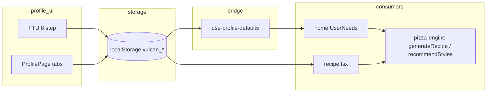

# Profilo e vincoli utente
> Aggiornamento: 2026-07-13 | Stato: ✅ | File documentati: 5

## Sommario

Persistenza preferenze utente in **localStorage** e bridge verso `UserConstraints` del motore. `profile.tsx` (2400 righe) è la pagina **Profilo** con FTU (First Time Use) ridotto a 3 domande + congedo, forno, skill, dispensa, attrezzatura avanzata, dieta, geolocalizzazione, tema, unità metric/imperial e gate PizzaNerd. `use-profile-defaults.ts` (VPL-067) legge le stesse chiavi per home e wizard. `user-needs.tsx` (1366 righe) è il pannello **Step 1** della home: slot tempo, forno, porzioni, T cucina (meteo), dispensa sessione e sezione "Tu".

## File chiave

| File | Righe (circa) | Ruolo |
|------|----------------|--------|
| `src/app/pages/profile.tsx` | 2400 | UI profilo, FTU 3 domande + congedo, preferenze unità, PizzaNerd, salvataggio preferenze, reset confermato |
| `src/app/hooks/use-profile-defaults.ts` | 145 | `loadProfileDefaults()` / `useProfileDefaults()` → `UserConstraints` + `pizzaNerdEnabled` |
| `src/app/features/recipe/user-needs.tsx` | 1366 | Wizard home: constraints live, weather, time slots con sublabel dinamico e nuova sezione "Tu" |
| `src/app/adapters/browser/saved-recipes-storage.ts` | 110 | Adattatore browser per la persistenza locale e il recupero del ricettario personalizzato |
| `src/app/data/saved-recipes.ts` | 159 | Ricettario personale, preferiti stile, dedup parametri, date relative, integrato con l'adattatore |

**Integrazioni:** `home.tsx` (`useProfileDefaults` + `UserNeeds`), `recipe.tsx` (carica direttamente oven/skill/pantry/dietary da localStorage), `equipment-data.ts` (picker attrezzatura), `pizza-engine` (`UserConstraints`, `OVEN_PRESETS`, `SKILL_LEVELS`, `generateTimeSlots`).

## Flusso dati

1. **Scrittura:** ogni modifica profilo (o fine FTU) chiama `saveJson` / `setItem` sulle chiavi sotto.
2. **Lettura home:** al mount, `useProfileDefaults()` costruisce `constraints` iniziali; `UserNeeds` può sovrascrivere in sessione (forno, T cucina, pantry) e riscrivere `vulcan_oven_pref` / `vulcan_pantry` quando l’utente interagisce.
3. **Lettura ricetta:** `recipe.tsx` duplica `loadJson` per oven, skill, pantry, dietary (non usa l’hook — stesso contratto chiavi).
4. **Completezza:** `vulcan_profile_complete === "true"` dopo FTU; usato per UX ma non blocca il motore.

## Funzioni principali

### `profile.tsx`

| Elemento | Scopo |
|----------|--------|
| `loadJson` / `saveJson` / `loadString` | Helper localStorage con try/catch |
| `FTUFlow` (componente interno) | Onboarding a 3 domande: forno → skill → pantry + schermata finale di successo/consigli |
| `handleFinish` (FTU) | Salva oven, skill, pantry opzionale e `PROFILE_COMPLETE_KEY`; le preferenze avanzate restano nella pagina profilo completa |
| `migrateEquipment` + picker | Stato attrezzatura avanzato con CMS localizzato |
| Geocoding | Nominatim OpenStreetMap (search + reverse + geolocation API) |
| Reset profilo | `removeItem(PROFILE_COMPLETE_KEY)` e clear preferenze |

### `use-profile-defaults.ts`

| Export | Scopo |
|--------|--------|
| `loadProfileDefaults()` | Legge storage → `UserConstraints` + `summaryLabel` + `isProfileComplete` |
| `useProfileDefaults()` | `useMemo` wrapper senza re-read su ogni render (deps vuote) |

Campi popolati in `UserConstraints`: `oven_type`, `oven_max_temp_c`, `skill_level`, `dietary_filters`, `pantry_flours`, `pantry_yeasts`, `has_mixer` / stone / steel / pan, opzionalmente `mixer_type` e `surfaces`. Il ritorno include anche `pizzaNerdEnabled` derivato da `vulcan_nerd_on`.

Default se assente storage: forno `home` 250°C, skill `2`, `available_hours: 24`, `dough_balls: 4`, `kitchen_temp_c: DEFAULT_KITCHEN_TEMP`.

### `user-needs.tsx`

| Export / elemento | Scopo |
|-------------------|--------|
| `UserNeeds` | Controlli wizard: slot tempo, forno, skill, porzioni, idratazione custom, pantry branded/generica |
| `getSuggestedSlot()` | Suggerisce slot in base all’ora |
| `useLocationWeather()` | Meteo → `kitchen_temp_c` via `outdoorToKitchenTemp` |
| `loadSavedOven` / `saveOven` | Sync con `vulcan_oven_pref` |
| `FLOUR_OPTIONS_GENERIC` / `BRANDED` | Dispensa UI (ids non sempre = ids `FLOURS_DB`) |

Nota: filtri dietetici in wizard sono stati spostati verso `recommended-styles` (commento in codice); profilo resta fonte per `dietary_filters` in storage.

## Costanti e configurazione

| `vulcan_profile_complete` | `"true"` dopo FTU |
| `vulcan_ovens` | `string[]` (Array JSON di ID forni posseduti) |
| `vulcan_mixers` | `string[]` (Array JSON di ID impastatrici possedute) |
| `vulcan_skill_level` | `SkillLevel` 1–3 |
| `vulcan_pantry` | `{ flours: string[], yeasts: string[] }` |
| `vulcan_dietary` | `string[]` (id da `dietary-data`) |
| `vulcan_equipment` | `EquipmentState` legacy (sincronizzato per retrocompatibilità) |
| `vulcan_location` | `{ lat, lon, city }` |
| `vulcan_unit_system` | `"metric"` / `"imperial"` per formatter CMS |
| `vulcan_nerd_on` | `"true"` / `"false"` gate PizzaNerd |
| `vulcan_saved_recipes` | Array `SavedRecipe` max 30 |
| `vulcan_fav_styles` | Array `styleId` preferiti canonici |

**FTU pantry ids (semplificati):** `00`, `0`, `manitoba`, `integrale`, `semola` + speciali hardcoded. **Lieviti:** `fresh`, `dry`, `sourdough`.

**CMS:** testi FTU e profilo da `useCms().profile` / `CMS_DEFAULTS`; locale da `LOCALE_META` / cambio lingua in pagina.

## Guard rail e vincoli

- **Icona Forno a Legna**: Per differenziare visivamente il forno a legna (`wood`) dal forno a gas (`gas`), l'icona associata in `OVEN_ICONS` è stata impostata a `Trees` (invece di `Flame`).
- **Sublabel fasce orarie**: Nella selezione degli slot di pasto in `UserNeeds`, l'applicazione visualizza sempre il sublabel dinamico (calcolo in tempo reale delle ore mancanti) rispetto ai sublabel fissi del CMS, prevenendo fraintendimenti operativi.
- **Sezione "Tu" e Livello Esperienza**: Il selettore del livello di esperienza (skill) è stato spostato in una nuova sezione comprimibile denominata "Tu" sotto la dispensa. Mostra un riepilogo inline con il formato numerico e testuale del livello (es. `LV2 · Intermedio`) per una migliore contestualizzazione.
- **Multi-select e validazione attrezzatura (Sprint 12)**: Forni (`ovens`) e impastatrici (`mixers`) sono salvati come array nel profilo, con il vincolo che almeno uno di ciascun gruppo deve rimanere selezionato (l'ultimo non è deselezionabile).
- **Migrazione legacy**: Al primo caricamento, le vecchie chiavi stringa singola (`vulcan_oven` e `vulcan_mixer`) vengono migrate rispettivamente ad array di 1 elemento (`vulcan_ovens` e `vulcan_mixers`) e rimosse dallo storage.
- **Ordinamento Forni nel Profilo**: Quando l'utente seleziona un nuovo forno nella lista dei forni posseduti in `ProfilePage`, quest'ultimo viene posizionato come primo elemento dell'array `ovens` (`[preset.id, ...prev.filter(...)]`) e le relative temperature vengono allineate. Questo garantisce che i componenti consumatori (che leggono l'array per intero o tramite `ovens[0]`) ricevano correttamente il forno attivo.
- **Bypass FTU per Utenti Ricorrenti**: Se il profilo utente non è completo in `localStorage` ma in precedenza sono state salvate ricette o preferiti, la schermata di onboarding FTU viene automaticamente bypassata per non bloccare l'accesso al servizio.
- **Unità di misura**: il profilo salva `vulcan_unit_system` tramite `savePreferredUnitSystem`; i componenti devono passare da `createFormatter`, non concatenare unità hard-coded.
- **PizzaNerd**: il profilo salva `vulcan_nerd_on` e rimuove il legacy `vulcan_view_mode`; Home e Recipe usano il gate per mostrare i toggle locali.
- **Chiavi condivise:** qualsiasi modifica a nomi chiavi richiede aggiornamento parallelo in `profile.tsx`, `use-profile-defaults.ts`, `user-needs.tsx`, `recipe.tsx`.
- **Hook statico:** `useProfileDefaults` non si aggiorna se un altro tab modifica localStorage nella stessa sessione (nessun `storage` event).
- **Equipment:** bridge imposta `has_*` da boolean legacy; `mixer_type`/`surfaces` solo se chiave nuova presente.
- **Privacy rete:** geocoding esterno (Nominatim); fallimento silenzioso con catch vuoti.
- **IDS dispensa:** ids branded in `user-needs` (es. `caputo_pizzeria_blu`) possono differire da `flour-database` (`caputo_pizzeria`) — attenzione in integrazioni future.

## Bug noti e fix

- **VPL-067 chiuso in dev-tools** ma `recipe.tsx` non usa `useProfileDefaults` (duplicazione load) — rischio drift se una path aggiorna solo una delle due.
- FTU salva `mixers_owned` e `mixer_type` primario; `loadProfileDefaults` non mappa `mixers_owned` in constraints.
- `useProfileDefaults` `useMemo([], [])` non riflette cambi profilo fino a remount pagina home.
- `recipe.tsx` legge direttamente `vulcan_nerd_on` e profilo base invece di passare da `useProfileDefaults`; rischio drift se si cambia contratto storage.
- Per allineamento post-modifica codice profilo: `kipi update profile-user`.

## Ricettario Personale (Saved Recipes)

Introdotta a giugno 2026, la funzionalità consente di salvare ricette personalizzate per potervi accedere rapidamente in un secondo momento, salvaguardando le tarature fatte dall'utente.

### 1. Scelta Architetturale: Parametri vs Output Generato
A differenza di un approccio ingenuo che memorizzerebbe l'intero output della ricetta (grammi di acqua/lievito, ore calcolate, score), lo store in `saved-recipes.ts` persiste unicamente la struttura `SavedRecipeParams`:
- **Rationale**: Poiché il motore scientifico subisce continuamente migliorie e calibrazioni (es. modelli di compensazione, coefficienti Q10), memorizzare i grammi statici renderebbe la ricetta obsoleta. Salvando solo i parametri di input (idratazione, W farina, P/L, ore, temperatura, uso biga/poolish, panetti, teglia e farina specifica), l'applicazione è in grado di **rigenerare dinamicamente** la ricetta ad ogni caricamento, garantendo che sia sempre allineata all'ultima versione del motore e che i calcoli siano scientificamente coerenti.
- **Eccezione display**: Viene memorizzato solo lo `score` composito al momento del salvataggio, ad esclusivo uso visivo nell'elenco cronologico.

### 2. Logica di Identità e Rilevamento Duplicati
Per evitare di riempire la memoria con copie identiche, l'identità di una ricetta salvata viene determinata mediante la funzione `recipeKey`:
- Viene creata una stringa concatenata dei parametri salienti: `styleId|hydration|flourW|flourPL|fermentHours|fermentTemp|usePreFerment|doughBalls|ovenType|ovenTemp`.
- All'atto del salvataggio (`saveRecipe`), eventuali ricette preesistenti con lo stesso hash vengono sovrascritte, spostando la ricetta in cima alla lista (ordinamento cronologico decrescente).
- **Limite di capacità**: Lo store limita l'archiviazione a un massimo di **30 ricette** (`MAX_SAVED`) per evitare degradazione delle prestazioni del browser.

### 3. Integrazione con lo Storage (`localStorage`)
- **Chiave**: `vulcan_saved_recipes` (Array JSON di oggetti `SavedRecipe`).
- **Data di creazione**: Memorizzata come timestamp Unix (`createdAt`) e formattata lato interfaccia tramite `formatSavedDate` in un formato breve localizzato in italiano ("oggi", "ieri", "X giorni fa" o data esplicita es. "12 giu").

### 4. Preferiti Stile vs Ricette Salvate
`saved-recipes.ts` distingue due intenzioni:
- `vulcan_fav_styles`: cuore/preferito su uno stile canonico, salvato come lista di `styleId`.
- `vulcan_saved_recipes`: segnalibro della ricetta su misura, salvata con parametri e topping selezionato.

La chiave di deduplica `recipeKey` include anche `selectedToppingConcept`, quindi due ricette con stessi parametri ma condimento diverso restano distinte.
