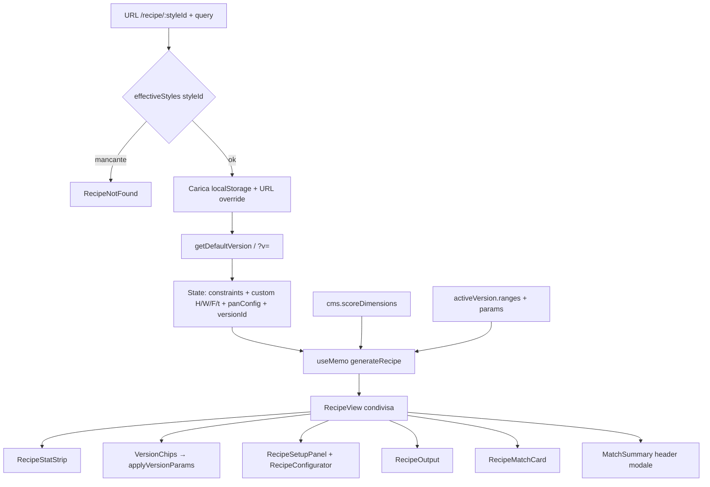

# Flusso ricetta e UI
> Aggiornamento: 2026-06-27 | Stato: ✅ | File documentati: 15

## Sommario

Due entry point conducono alla stessa pipeline `generateRecipe` → `RecipeView` condivisa:

1. **Home** (`/`) — wizard in 3 step: impostazioni utente → scelta stile → risultato inline in `RecipeView` con variante "Ricetta su misura".
2. **Pagina ricetta** (`/recipe/:styleId`) — vista dedicata per uno stile, con URL condivisibili (VPL-064), profilo da `localStorage`, versioni stile, topping e pannello didattico.

Componenti condivisi: `RecipeView`, `RecipeSectionTabs`, `RecipeConfigurator`, `RecipeOutput`, `RecipeStatStrip`, `RecipeMatchCard` e `ScoreRing` nelle liste stile (capitolo scoring-feedback). Il motore è in `pizza-engine.ts` (capitolo pizza-engine).

## File chiave

| File | Ruolo |
|------|--------|
| `src/app/pages/recipe.tsx` | Route `/recipe/:styleId`; URL query per caricamento parametri/versioni; gestisce parallax scroll su hero ed effettua il mount di `RecipeSetupPanel` |
| `src/app/pages/home.tsx` | Wizard `AppStep`: `settings` \| `styles` \| `result`; instanzia `useRecipeState` per la configurazione live dei parametri; redirect a `/profile` se onboarding incompleto |
| `src/app/hooks/use-recipe-state.ts` | Custom Hook che incapsula lo stato reattivo della ricetta (parametri custom, versione attiva, interpretazione e pan) per Home e RecipePage |
| `src/app/features/recipe/recipe-setup-panel.tsx` | Pannello di setup/customizzazione ricetta estratto da `recipe.tsx`; gestisce la selezione delle versioni d'autore (via `PremiumSelect`) e dei parametri con scroll lock del body |
| `src/app/features/recipe/recipe-view.tsx` | Shell condivisa della scheda ricetta per Home e Detail: hero, back/share, tab Ricetta/Procedimento, slot match/intro/controlli e render di `RecipeOutput` |
| `src/app/features/recipe/recipe-section-tabs.tsx` | Tab primary `ricetta` / `procedimento`, inline o navbar mobile, con label CMS e ARIA tablist |
| `src/app/features/recipe/recipe-match-card.tsx` | Card compatibilità/fattibilità: composite score, stato forno e barre dei 5 assi con label estese CMS |
| `src/app/features/recipe/recipe-learning-panel.tsx` | Dialog "Approfondimento" su stile: descrizione, famiglia/origine e caratteristiche chiave |
| `src/app/features/recipe/recipe-configurator.tsx` | Slider parametri, Smart Link, adaptive hints, `PremiumSelect`; export `VersionChips` e `applyVersionParams` |
| `src/app/features/recipe/recipe-output.tsx` | Procedimento e ingredienti; timeline con orari e descrizione estesa; proximity UI #54 per teglie; stima persone; toggle sub-pannello regola 55; condimenti riscalati; comfort time alert con ricalcolo suggestedStart locale BCP-47 |
| `src/app/features/recipe/recipe-stat-strip.tsx` | 4 KPI (idratazione, forno, cottura, lievitazione) + riga nerd opzionale |
| `src/app/features/cooking/cook-session.tsx` | Context provider e gestore dello stato persistente della sessione di cottura attiva (`vulcan_cook_session` in `localStorage`), inclusi i countdown e le notifiche di sistema |
| `src/app/features/cooking/active-cook-widget.tsx` | Widget mobile-friendly galleggiante (Live Activity su web) visibile globalmente in tutta l'applicazione per monitorare il progresso dello step corrente |
| `src/app/features/cooking/cooking-mode.tsx` | Overlay immersivo a schermo intero per la guida passo-passo durante la preparazione, integrato con Wake Lock API per mantenere lo schermo active |
| `src/app/features/cooking/step-illustrations.tsx` | Componente per il rendering di grafiche line-art SVG ottimizzate per il responsive e il tema (dark/light mode), che funge da fallback per futuri video |

**Route:** `src/app/routes.ts` — `{ path: "recipe/:styleId", Component: RecipePage }`.

**Collegamenti esterni:** `explore.tsx` e `search-overlay.tsx` linkano a `/recipe/:id`; `use-profile-defaults.ts` condiviso con home.

## Flusso dati



**Home (parallelo):** `useProfileDefaults()` → `handleSelectStyle` imposta parametri da `getDefaultVersion` → `useMemo(generateRecipe)` quando `selectedStyle` non è null → step `result` mostra stat strip, configurator, output, score.

**Chiamata motore** (identica in `recipe.tsx` e `home.tsx`):

```ts
generateRecipe(
  style,
  { ...constraints, dough_balls },
  customHydration,
  customFlourW,
  customFermentHours,
  customFermentTemp,
  usePreFerment,
  customFlourPL,
  panConfig,
  scoreWeights,      // da cms.scoreDimensions
  versionOverrides,  // activeVersion.ranges + dough_weight_g opzionale
);
```

**Priorità inizializzazione parametri (recipe page):** `?v=` versione → `getDefaultVersion(style.id, skill)` → centro range stile. URL query (`h`, `w`, `pl`, `f`, `t`, `n`, `pf`, `oven`, `temp`) sovrascrivono i default. Profilo: `vulcan_oven_pref`, `vulcan_skill_level`, `vulcan_pantry`, `vulcan_dietary`.

**Share link (VPL-064):** `recipe.tsx` calcola `shareUrl` con stato corrente in query string; `RecipeView` gestisce Web Share API o fallback clipboard.

## Funzioni principali

| Simbolo | File | Descrizione |
|---------|------|-------------|
| `RecipePage` | `recipe.tsx` | Wrapper: `useParams`, `useStylesOverride`, delega a `RecipeContent` o not-found |
| `RecipeContent` | `recipe.tsx` | Tutta la logica stato + layout pagina |
| `numParam` | `recipe.tsx` | Parse numerico URL con clamp min/max |
| `loadJson` | `recipe.tsx` | Lettura sicura `localStorage` |
| `defaultPL` | `recipe.tsx`, `home.tsx` | Centro range P/L dello stile |
| `useBodyScrollLock` | `recipe.tsx` | Blocca scroll pagina sottostante quando `RecipeSetupPanel` è aperto, preservando e ripristinando `window.scrollY` |
| `RecipeSetupPanel` | `recipe.tsx` | Modale per versione/interpretazione e configuratore; header stabile con `MatchSummary`, chiusura overlay/Escape, footer "Fatto" |
| `MatchSummary` | `recipe.tsx` | Score compatto nell'header modale: chip composite + assi estesi su desktop |
| `HomePage` | `home.tsx` | Wizard 3 step, `handleSelectStyle`, `handleGenerateRecipe` |
| `RecipeView` | `recipe-view.tsx` | Layout unico di scheda ricetta: hero dinamico, tab Ricetta/Procedimento, share, slot e `RecipeOutput` |
| `RecipeSectionTabs` | `recipe-section-tabs.tsx` | Switch a due tab con variante `inline` o `navbar` |
| `RecipeMatchCard` | `recipe-match-card.tsx` | Riassunto score + forno per Home e Detail |
| `RecipeLearningPanel` | `recipe-learning-panel.tsx` | Dialog didattico invocato da "Approfondisci" nella pagina ricetta |
| `applyVersionParams` | `recipe-configurator.tsx` | Applica `version.params` ai setter (esportata per chips a livello pagina) |
| `VersionChips` | `recipe-configurator.tsx` | Selezione interpretazione stile |
| `computeAdaptiveHints` | `recipe-configurator.tsx` | Suggerimenti W↔H, fermentazione↔temp, ecc. |
| `propagate` / Smart Link | `recipe-configurator.tsx` | Accoppia slider per ratio nei range versione/stile |
| `RecipeOutput` | `recipe-output.tsx` | Timeline, ingredienti, share/copy, `RecipeFeedbackForm` |
| `localizeStep` | `recipe-output.tsx` | Testi step da `cms.timelineLabels` |
| `getParametricTip` | `recipe-output.tsx` | Tip da `parametric-databases` per step mix/bulk/shape/top/bake |
| `RecipeStatStrip` | `recipe-stat-strip.tsx` | KPI da `GeneratedRecipe` + `createFormatter` |

## Costanti e configurazione

| Chiave / costante | Valore / uso |
|-------------------|--------------|
| `FALLBACK` (foto) | URL Unsplash default in `recipe.tsx` |
| `VALID_OVEN_TYPES` | Set da `OVEN_PRESETS.map(p => p.id)` |
| `SLIDER_GRADIENTS` | Token CSS `--grad-slider-*` nel configurator |
| Limiti slider URL | `h` 30–120, `w` 100–500, `pl` 0.2–1.5, `f` 1–120, `t` 0–35, `n` 1–20, `temp` 180–500 |
| `localStorage` profilo | `vulcan_oven_pref`, `vulcan_skill_level`, `vulcan_pantry`, `vulcan_dietary`, `vulcan_profile_complete` |
| `localStorage` sessione cucina | `vulcan_cook_session` |
| `localStorage` ricettario | `vulcan_saved_recipes`, `vulcan_fav_styles` |
| `AppStep` | `"settings" \| "styles" \| "result"` (home) |
| Range slider UI | H 45–105%, W 100–420, P/L 0.30–0.90, fermentazione 1–96 h, forno 200–550°C |

## Guard rail e vincoli

- Stile assente in `effectiveStyles` → pagina not-found CMS, link a `/explore`.
- `RecipePage` usa `effectiveStyles ?? STYLES_DB` (override dev attivo).
- `handleOvenSelect` aggiorna `oven_type` e `maxTemp` in **una** chiamata (evita doppio update).
- Smart Link: `propagatingRef` evita loop; disattivato durante `applyVersionParams` (evita propagazioni indesiderate).
- **Pannello personalizzazione**: `RecipeSetupPanel` (estratto come componente autonomo) usa una modale `aria-modal` con altezza deterministica, header `flex-shrink-0`, titolo troncabile e score compatto responsive. Quando è aperto imposta `body` fixed/hidden e `html` hidden + `overscrollBehavior: none`, così lo scroll sottostante resta bloccato ma il corpo della modale resta scrollabile.
- **Versioni e firme**: il selettore compatto vive nel pannello e combina versioni di impasto e interpretazioni d'autore tramite `PremiumSelect`, invece di dipendere da file chip dedicati.
- **Timeline UX**: badge orario allineato dinamicamente. Supporto per la descrizione estesa `longDesc`. Rimozione del badge ridondante "giorno dopo".
- **Gestione Layout e Panetti Gemelli**: In `RecipeOutput` la ricetta calcola dinamicamente lo sdoppiamento del peso se `pieces_per_unit > 1`, indicando ad esempio "2 x Panetti gemelli da 400g" per una teglia di Pizza Baciata.
- **Iniezione Toppings**: La UI mostra selettori dedicati per la selezione dei condimenti (Toppings). La timeline visualizza i passaggi specifici (es. mandolina patate o sdoppiamento e farcitura porchetta post-cottura) prelevandoli dinamicamente da `TOPPING_LIBRARY` e iniettandoli nei giusti slot temporali.
- **Serving Units**: I testi e i pulsanti della ricetta si adattano dinamicamente all'unità di servizio dello stile (es. "Panetti", "Teglie", "Padellini", "Focacce") anziché usare la dicitura fissa "Panetti".
- **Etichette Sezione Dinamiche (Condimento vs Farcitura)**: La tab e l'header della sezione del condimento si adattano dinamicamente in base allo stile tramite `isFillingStyle`. Se lo stile è farcito/ripieno (es. calzone, spaccata, baciata), la label viene convertita in "Farcitura" (o "Filling" in EN) usando il valore `fillingTitle` del CMS.
- **Placeholder Grafico per Topping**: In `RecipeOutput`, se un condimento non dispone di una miniatura nel catalogo (`TOPPING_CONCEPTS`), viene applicato un file vettoriale SVG di default (`_placeholder.svg`) al posto di mostrare un fallback testuale/emoji.
- **Apertura Automatica Tab Condimento**: Se la pagina ricetta viene caricata con un condimento pre-selezionato nella query string (`?topping=`), lo stato iniziale della scheda imposta automaticamente la tab attiva su "Condimento" anziché "Ricetta".
- **Indici Numerati degli Ingredienti**: La lista ingredienti dei condimenti in `RecipeOutput` mostra ora un badge circolare con l'indice numerico progressivo per facilitare la sequenzialità dei passaggi.
- **Ordinamento Dinamico Sezioni Ingredienti**: Le sezioni degli ingredienti del topping (base, ripieno, superficie, ecc.) vengono disposte dinamicamente nell'ordine esatto in cui compaiono nella ricetta tramite `getToppingIngredientSectionOrder` (anziché seguire una sequenza statica predefinita).
- **UX Proximity #54 (Dimensioni Teglia)**: Se lo stile richiede una teglia, le dimensioni attive (es. `40×30 cm` o `Ø28 cm`) vengono visualizzate a fianco del selettore di porzioni, risolvendo la co-locazione delle info.
- **Stima Persone**: Calcolo dinamico del numero stimato di persone servite basato sullo stile e sul numero di porzioni (es. `≈ 4-6 persone`), visualizzato a fianco del contatore porzioni con riscalamento ingredienti e topping condimenti.
- **Pannello Regola 55**: Sub-pannello spiegazione formula attivabile con un click su pulsante help per chiarire il calcolo della temperatura dell'acqua, gestito dallo stato locale `showRule55Tip`.
- **Comfort Time Alert (Orari notturni)**: Allerta euristica in `RecipeOutput` se fasi manuali "attive" (impasto, staglio, stesa, cottura) cadono tra 23:00 e 07:00 (`isNightHour`), calcolando dinamicamente `suggestedStart` e gli orari con standard localizzato BCP-47. In `home.tsx` il wizard include `activeVersionId` e chip configurazione live.
- **Visualizzazione ingredienti Topping**: Scomposizione analitica degli ingredienti del condimento selezionato con quantità totali riscalate per il numero di porzioni, completando il flusso d'acquisto.
- **Effetti Visivi (Parallax)**: Scrolling ed effetti di profondità dinamici sulla foto hero della ricetta tramite Framer Motion (`useScroll` e `useTransform`), combinato con un contenitore glassmorphic per i dettagli dello stile.
- **Accessibilità ed ARIA (Sprint 12)**: I pulsanti ad icona senza testo descrittivo del configuratore ricetta sono stati dotati di attributi corretti `aria-label` e `aria-pressed` per i lettori di schermo.
- **Rimozione codice e parametri morti**: Rimosso il prop non utilizzato `onVersionChange` in `RecipeConfiguratorProps` destructuring e il parametro `last` in `StatCell`/`NerdCell` del componente `RecipeStatStrip`.
- P/L slider visibile solo con `nerdMode` (`customFlourPL` / `onFlourPLChange` opzionali).
- `dough_balls` sincronizzato tra `constraints` e lo stato locale/configurator.
- Home: redirect `replace` a `/profile` se `vulcan_profile_complete !== "true"`.
- `canGenerateRecipe`: solo `selectedStyle !== null` (time slot opzionale, VPL-068).
- Output null se `generateRecipe` fallisce — UI score/output non renderizzata.
- **RecipeView unica**: Home e pagina dettaglio non devono divergere nel layout principale; eventuali differenze passano da props (`tailored`, `back`, `matchSlot`, `introExtraSlot`, `recipeControls`).
- **PizzaNerd**: non esiste più un file `view-mode.tsx`. Il profilo salva `vulcan_nerd_on`; Home e Detail tengono uno stato locale `nerdMode`, attivo solo se il profilo abilita PizzaNerd.
- **Beginner Flour Picker**: Quando `skill_level === 1` (principianti), lo slider alveografico W/P/L viene nascosto in `recipe-configurator.tsx` e sostituito da `BeginnerFlourPicker` con scelte in linguaggio naturale ("Debole" [W 185], "Media" [W 250], "Forte" [W 350]) associate a feedback dinamico sull'idoneità per lo stile.
- **Warning termico in RecipeMatchCard**: Se il forno non raggiunge la temperatura minima dello stile, viene mostrato il warning termico (`feas.thermalUnviable`) sotto le statistiche del forno risolvendo l'omissione precedente.
- **Bypass traduzioni generiche per mixer e forno**: In `RecipeOutput` (funzione `localizeStep`), per la fase `"mix"` (se non no-knead) e per la fase `"bake"` viene bypassata la localizzazione statica del CMS. Questo permette di renderizzare i passaggi dettagliati prodotti dinamicamente dal motore, specificando tempi/consigli per impastatrici (spirale, planetaria, forcella, a mano) e configurazioni specifiche del forno (resistenze, ripiano, grill).
- **Default fermentazione style-aware in useRecipeState**: Lo stato di default reattivo usa `defaultFermentTempC(style, hours)` per allinearsi al comportamento del motore ed evitare forzature a 4°C sugli stili a TA.
- **Inizializzazione e Auto-Ottimizzazione in Home**: In modalità "adapted", all'apertura dello stile viene eseguita automaticamente un'ottimizzazione (`optimizeForConstraints`) se non ci sono versioni/interpretazioni caricate, fornendo istantaneamente una ricetta su misura. La valutazione della ricetta "canonica" avviene ora sul forno effettivo dell'utente invece di forzare il forno ideale dello stile (che nascondeva la reale fattibilità).
- **Pulsante e rationale di ottimizzazione**: Il pulsante "Ottimizza per me" e la rationale associata sono controllati dinamicamente. Se la ricetta corrente coincide esattamente con l'ottimo teorico calcolato, il pulsante viene nascosto (evitando ridondanze) e viene visualizzata la spiegazione delle scelte effettuate (rationale localizzata). Se l'utente modifica i parametri con gli slider, il pulsante riappare.
- **Stati della Ricetta in Home e Detail**: Il badge dello stato mostra "Ricetta canonica", "Su misura per te" (se ottimizzata/adattata) o "Personalizzata" (se modificata manualmente).
- **Parità di ottimizzazione e diagnosi in RecipePage**: La pagina ricetta di dettaglio (`recipe.tsx`) integra la parità funzionale con la Home: calcola il composite score ottimizzato ($M_o$ / `ceilingInfo`), esegue l'ottimizzazione parametri via "Ottimizza per me" e diagnostica i colli di bottiglia termici (vincoli hard) o gli ingredienti mancanti (vincoli soft).
- **Inizializzazione temperature style-aware in RecipePage**: La temperatura di fermentazione iniziale nei parametri personalizzati usa `defaultFermentTempC` dello stile sul midpoint delle ore.
- **Navigazione Tab via URL e Toppings**: La tab attiva di `RecipeContent` imposta `"condimento"` se è presente un condimento nella query string (`?topping=`), ma rispetta l'eventuale parametro esplicito `?tab=` se valorizzato a `"ricetta"`, `"procedimento"` o `"condimento"`.
- **Prevenzione Suffixi Doppi ed Errori di Unità**: In `RecipeOutput` (funzioni `localizeStep`, `formatIngredientsText`), regex di normalizzazione (`normalizeTemperatureUnitSuffixes` e `normalizeMeasureUnitSuffixes`) ripuliscono il testo da suffixi duplicati (come `°C °C` o `g g`) generati da interpolazioni del CMS e del formatter.
- **Indicatori Visivi dei Parametri Adattati (Chevron di scostamento)**: In `RecipeStatStrip`, le celle principali (idratazione, lievitazione) e la cella nerd (forza W farina) visualizzano una piccola freccia `ChevronUp` o `ChevronDown` colorata in `--cta` se il valore devia dal midpoint dello stile, indicando con un tooltip il valore canonico di confronto dello stile.
- **Accessibilità del focus in RecipeSetupPanel**: All'apertura del pannello personalizzazione ricetta, il focus viene spostato via `closeButtonRef` in un frame di animazione (`requestAnimationFrame`) per garantire l'accessibilità da tastiera.

## Bug noti e fix

| ID / area | Stato | Nota (dal codice) |
|-----------|--------|-------------------|
| VPL-064 | implementato | URL condivisibili + fallback clipboard `textarea` |
| Oven double-update | fix | `handleOvenSelect` singolo `onConstraintsChange` |
| Timeline temp ideale vs reale | fix motore | ADV-05 in `feedback-store` — `generateTimeline` usa `oven_temp_c` effettivo |
| `recipe.tsx` riga 467 | hardcoded | Label hero `"Ricetta"` non passa da CMS |
| Pannello "Personalizza parametri" | ✅ Fix UI | Header stabilizzato e scroll pagina sottostante bloccato con `useBodyScrollLock`; validato desktop/mobile il 2026-06-19 |
| Orari notturni | ✅ UX | Allerta euristica in `RecipeOutput` se fasi manuali cadono tra 23:00 e 07:00, con suggerimento orario alternativo e pulsante per spostare l'inizio |

### 3. Selezione del Topping e Visualizzazione Autenticità (Sprint 12 Fase 3)
La selezione del condimento passa dal flusso ricetta e dalla libreria `topping-library.ts`.
- **Modello Stretto Per-Stile**: Risolto tramite `getRecipesByAuthenticity(style)` di `topping-library.ts` che restituisce *esclusivamente* i condimenti esplicitamente assegnati a quello stile (senza fallback generici o di famiglia).
- **Nome Variante in UI**: Nel selettore rapido dei condimenti (`CondimentChoiceStrip`), l'etichetta visualizzata non mostra più il livello di autenticità teorico, bensì il nome specifico della variante (`recipe.variant_name`).
- **Color-Coding Psicologico ed Autenticità**: Risolve il livello di autenticità (`AuthenticityScore` e colore associato) tramite `getConceptsByAuthenticity(style)` di `topping-library.ts`:
  - `🟢 canonical / natural` (Verde, corrispondenza classica/naturale)
  - `🟡 common` (Ambra, corrispondenza comune)
  - `🟠 experimental` (Arancione, deviazione sperimentale da altre famiglie, racchiusa sotto la tendina "Sperimenta")
  - `🔴 taboo` (Rosso, incompatibilità tecnica o disciplinare vietata, visualizzata in un pannello di allerta specifico `AlertTriangle` in fondo)
- **Visualizzazione Dark Mode**: Mappe `HUE_TO_CSS` risolvono i colori usando la funzione nativa di mix cromatico CSS `color-mix(in srgb, ...)` per assicurare contrasto e leggibilità in dark e light mode.
- **Nota update 2026-06-19**: il file dedicato `topping-chips.tsx` non è più presente nel codice; la KB mantiene qui il comportamento di dominio, non un riferimento a un componente fisico.

## Modalità Cucina Attiva e Cook Session

Introdotta a giugno 2026 per colmare il divario tra la natura prolungata della panificazione (fasi di lievitazione/maturazione che durano ore) e la rigida necessità di un'interfaccia interattiva sempre aperta.

### 1. Gestione dello Stato e Persistenza (`cook-session.tsx`)
La sessione di cottura viene gestita tramite un React Context (`CookSessionProvider`) e persiste nel `localStorage` sotto la chiave `vulcan_cook_session`. 
- **Scadenza automatica**: La sessione viene dichiarata scaduta e rimossa dopo 7 giorni dall'ultimo step per evitare overflow.
- **Fasi flessibili**: Metodi passivi e lunghi (es. `bulk` puntata, `proof` appretto, `preferment` biga/poolish) sono marcati come `flexible` (`FLEXIBLE_STEP_IDS`).
- **Orario onesto**: Gli step rigidi (es. formatura, cottura) mostrano l'orario esatto calcolato sul fuso locale, mentre quelli flessibili arrotondano ai 15 minuti più vicini (`formatStepClock`), riducendo l'ansia da prestazione per il pizzaiolo.
- **Visualizzazione in background**: Un timer in background monitora se il tab è visibile. Se l'utente cambia tab, il countdown della fase corrente viene mostrato direttamente nel titolo del browser (`document.title`), aggiornato ogni 30 secondi.
- **Notifiche push web**: Quando scade lo step corrente (es. giunge il momento dello staglio), il provider invia una notifica nativa di sistema best-effort (`Notification.requestPermission`) se autorizzato.

### 2. Live Activity Web: `ActiveCookWidget`
Un widget flottante fisso in basso sopra la barra di navigazione (`z-index: 60`) funge da barra di stato globale del progresso:
- **Anello circolare di progresso**: Un anello SVG dinamico calcola la percentuale degli step completati sull'arco totale (`idx / total`) con animazione di rotazione per il progresso.
- **Stato dinamico e allerta**: Quando scade il tempo per iniziare la fase successiva, l'icona con la fiamma pulsa con un'animazione `motion.span` (Framer Motion) e il widget cambia bordo colorandosi in rosso/arancione per attirare l'attenzione.
- **Ripristino rapido**: Facendo click in qualsiasi punto del widget, viene riaperto l'overlay della modalità cucina attiva.

### 3. Guida Immersiva: `CookingMode`
Overlay a schermo intero (`z-index: 200`) renderizzato via React Portal (`createPortal`) direttamente sul `body` del documento:
- **Wake Lock API**: Richiede l'accesso al blocco dello schermo (`navigator.wakeLock.request("screen")`) per impedire lo standby dello smartphone mentre l'utente ha le "mani in pasta" e sta lavorando. Il lock viene rilasciato automaticamente all'uscita o alla sospensione dell'app.
- **Navigazione sfogliabile indipendente**: L'utente può scorrere liberamente avanti/indietro tra tutti gli step tramite frecce a schermo o tastiera (`ArrowLeft` / `ArrowRight`), ma lo stato della sessione (lo step attivo reale) avanza solo premendo il pulsante "Fatto".
- **Illustrazioni SVG responsive (`step-illustrations.tsx`)**: Ogni fase ha una grafica line-art disegnata su una griglia fissa 120x94. Usando i token nativi (`var(--text-default)`, `var(--primary)`), le illustrazioni si adattano al tema grafico attivo (chiaro/scuro) e consentono il fallback su futuri contenuti multimediali.

## PizzaNerd nel Flusso Ricetta

La funzionalità **PizzaNerd** sostituisce il vecchio concetto di View Mode a tre livelli. È un gate esplicito nel profilo (`vulcan_nerd_on`) che abilita dati tecnici avanzati dentro Ricetta e Procedimento, senza creare un tab separato.

### 1. Gate da Profilo
- `profile.tsx` salva `vulcan_nerd_on` e rimuove l'eventuale legacy `vulcan_view_mode`.
- `use-profile-defaults.ts` espone `pizzaNerdEnabled` per Home; `recipe.tsx` legge direttamente `vulcan_nerd_on`.
- Se il gate è spento, gli switch locali non vengono renderizzati.

### 2. Effetti sul Rendering
- `RecipeOutput` trasforma le descrizioni inline scegliendo `tip.beginner` o `tip.nerd`, aggiunge blocchi `NerdAuraBlock`, parametriche tecniche, pre-ferment guide e compensazioni.
- `RecipeStatStrip` mostra la riga tecnica solo in `nerdMode`.
- `RecipeMatchCard` e il `MatchSummary` del pannello ricetta mostrano lo score sintetico; i dettagli tecnici restano nei blocchi nerd di `RecipeOutput`/`RecipeStatStrip`.
