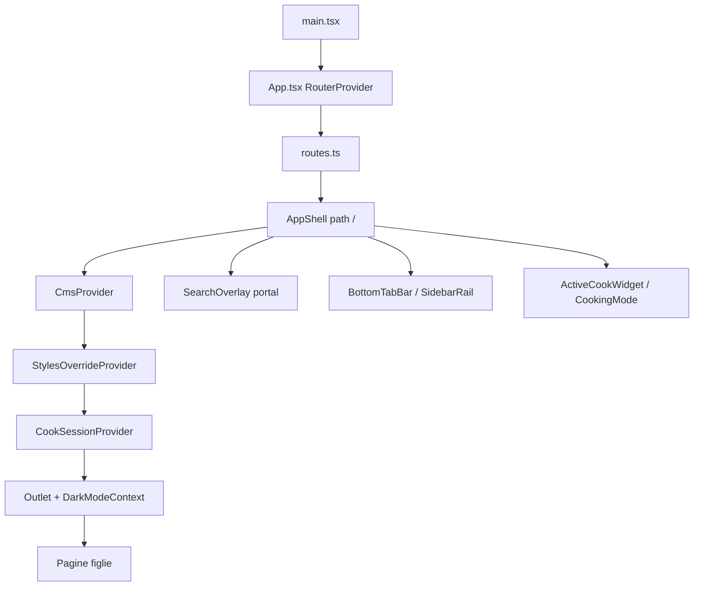

# Routing e shell app
> Aggiornamento: 2026-07-02 | Stato: ✅ | File documentati: 10

## Sommario

Vulcan è una **SPA React Router 7** (`createBrowserRouter`): entry `main.tsx` → `App.tsx` (`RouterProvider`) → albero route lazy in `routes.ts` con layout **`AppShell`** (tab bar Material 3, sidebar desktop, command palette ⌘K). Provider globali (`CmsProvider`, `StylesOverrideProvider`, `CookSessionProvider`) e contesto tema/dev vivono nello shell, non in `App.tsx`.

`RootLayout` è **deprecato** ma conservato per riferimento; il layout attivo è solo `AppShell`.

## File chiave

| File | Righe (circa) | Ruolo |
|------|----------------|--------|
| `index.html` | 92 | Entry point HTML, caricamento viewport-fit, anti-FOUC script sincrono e splash screen Vulcan |
| `src/main.tsx` | 13 | `createRoot` + `StrictMode` → `App` |
| `src/app/App.tsx` | 6 | `RouterProvider` con `router` da `routes.ts` |
| `src/app/routes.ts` | 98 | Definizione route lazy, redirect legacy (incluso prefermenti), catch-all |
| `src/app/components/shared/app-shell.tsx` | 756 | Layout principale, barre liquid-glass a 3 tab, trigger ricerca integrato, ProfileButton top-right, provider e sessione cucina globale |
| `src/app/components/shared/search-overlay.tsx` | 791 | Command palette: stili, glossario, problemi, guide, farine |
| `src/app/pages/not-found.tsx` | 73 | Pagina 404 personalizzata con fallback CMS ed animazioni spring |
| `src/app/components/shared/root-layout.tsx` | 82 | **@deprecated** — stesso pattern provider, dark mode booleano legacy |
| `src/app/components/shared/search-button.tsx` | 65 | Bottone circolare standardizzato "apri ricerca" (T5) con icona e dimensioni calcolate proporzionalmente |
| `src/vite-env.d.ts` | 1 | File di dichiarazione dei tipi client di Vite (asset statici, import.meta.env) |

**Config build**: `vite.config.ts` — porta dev **5174**, `historyApiFallback`, alias `@` → `src/`, chunk manuali (`vendor-react`, `vendor-motion`), plugin Tailwind e stub per import `figma:asset/...`.

## Flusso dati

**Route tree** (figli di `/` + `AppShell`):

| Path | Componente | Tab / note |
|------|------------|------------|
| `/` (index) | `HomePage` | Tab Crea |
| `/explore` | `ExplorePage` | Tab Scopri |
| `/learn` | `LearnPage` | Tab Impara |
| `/learn/glossary` | `GlossaryPage` | Sotto Impara |
| `/learn/troubleshooting` | `TroubleshootingPage` | Sotto Impara |
| `/learn/pre-ferments` | `PreFermentsPage` | Sotto Impara |
| `/profile` | `ProfilePage` | Pulsante Profilo top-right; non è nella tab bar |
| `/recipe/:styleId` | `RecipePage` | Dettaglio full-screen; chrome app nascosto |
| `/dev`, `/dev/:tab` | `DevToolsPage` | Tool — tab bar nascosta |
| `/design-system` | `DesignSystemPage` | Tool |
| `/cms` | `CmsPage` | Tool |
| `*` | `NotFoundPage` | 404 |

**Redirect legacy**: `/search` → `/`; `/styles` → `/explore`; `/troubleshooting` → `/learn/troubleshooting`; `/glossary` → `/learn/glossary`; `/recipe/pizza_patate_porchetta` → `/recipe/pizza_spaccata?topping=patate_porchetta` (lo stile patate e porchetta è stato rimosso e condotto a signature della Spaccata).

## Funzioni principali

| Funzione / componente | Scopo |
|------------------------|--------|
| `AppShell` | Stato `themeMode`, `darkMode`, `devMode`, `searchOpen`; applica `.dark` su `<html>`; shortcut globali |
| `getActiveTab(pathname)` | Mappa path → tab `create` \| `explore` \| `learn` \| `profile`; `/` exact match |
| `TabItem` | Label da `cms.pages[tab.labelKey]` con fallback IT hardcoded |
| `BottomTabBar` / `SidebarRail` | Navigazione mobile/desktop a 3 tab (Crea, Scopri, Impara) senza pulsante di ricerca |
| `ProfileButton` | Pulsante fisso top-right per `/profile`, sopra header sticky (`z-index: 60`) |
| `CookSessionUI` | Monta `ActiveCookWidget` e `CookingMode` a livello shell, così la sessione segue l'utente cross-page |
| `useLiquidNavState` | Stato scroll-aware per barre liquid-glass: nasconde/mostra navigazione in base alla direzione di scroll e rispetta reduced motion |
| `SearchOverlay` | Indicizza `STYLES_DB`, `GLOSSARY_TERMS`, `ISSUES_DB`, `PRE_FERMENT_DB`, `FLOURS_DB` e supporta il filtraggio in tempo reale tramite barra filtri in calce |
| `useDarkMode()` | Legge `Outlet` context da `root-layout.tsx` (tipo condiviso con shell) |

**Shortcut globali** (in `AppShell`):
- **⌘K / Ctrl+K**: toggle `SearchOverlay`
- **Ctrl+Shift+D**: se su `/dev` → `/`, altrimenti toggle `devMode` (link dev in sidebar rail se attivo)

## Costanti e configurazione

| Chiave localStorage | Valori | Uso |
|---------------------|--------|-----|
| `vulcan_dark_mode` | `light` \| `dark` \| `auto` (legacy `true`/`false` migrati) | Tema; `auto` segue `prefers-color-scheme` |
| `vulcan_dev_mode` | `"true"` / assente | Mostra link `/dev` nella sidebar |
| `vulcan_cook_session` | JSON sessione cucina | Countdown e overlay persistenti cross-page |

**Tab definitions** (`TABS` in `app-shell.tsx`):

| id | path | labelKey CMS | fallback |
|----|------|--------------|----------|
| create | `/` | `navCreate` | Crea |
| explore | `/explore` | `navExplore` | Scopri |
| learn | `/learn` | `navLearn` | Impara |

`PROFILE_TAB` è separato da `TABS`: serve a evidenziare `/profile`, ma il profilo viene renderizzato come pulsante impostazioni top-right e non occupa spazio nella barra principale.

**Visibilità chrome**: `isToolPage` nasconde tab bar e sidebar su path che iniziano con `/dev`, `/design-system`, `/cms`; `isRecipePage` nasconde il chrome su `/recipe/:styleId`. La content area si allinea con `md:ml-28 pb-20 md:pb-0` quando chrome è visibile. La navigazione è flottante: la bottom bar mobile galleggia a 24px (`bottom-6`) con angoli arrotondati ed ampiezza contenuta (`min(340px, 92vw)`); la sidebar desktop galleggia a 16px (`left-4 top-4 bottom-4`) con larghezza `72px` ed angoli arrotondati a `24px`.

La navigazione e la ricerca utilizzano una disposizione affiancata a capsule flottanti (ispirata a iOS 26 / Material Expressive):
- **Su Mobile**: A fondo pagina, la capsula dei tab `[ Crea | Scopri | Impara ]` (altezza 56px, larghezza `min(340px, 92vw)`) è affiancata a destra da un cerchio di ricerca indipendente `[ 🔍 ]` (56x56px, separato da un gap di `12px`). Entrambi gli elementi galleggiano a `bottom-6` e si nascondono in modo sincrono durante lo scorrimento verso il basso (`useScrollHidden`).
- **Su Desktop**: La sidebar laterale è sdoppiata in una capsula di navigazione principale (altezza dinamica, larghezza 72px) e un cerchio di ricerca flottante indipendente `[ 🔍 ]` (72x72px) posizionato subito sotto di essa.
Questo design lascia l'header superiore completamente libero per i loghi, titoli e pulsanti Indietro, eliminando la necessità di nascondere elementi a scorrimento zero o di applicare ampi margini compensatori.

**Vite dev server**: `strictPort: true`, `open: true`, SPA fallback su `index.html`.

## Guard rail e vincoli

- **Un solo layout root** con provider: evitare annidare `CmsProvider` nelle pagine figlie.
- **Portali** (search overlay): `createPortal` su `document.body`; classe `.dark` deve stare su `<html>` (gestito in shell).
- **Supporto Safe Area e Viewport Dinamico**: In `app-shell.tsx`, `active-cook-widget.tsx` e `cooking-mode.tsx`, il posizionamento degli elementi (es. `BottomTabBar`, `ProfileButton`, `ActiveCookWidget`, `CookingMode` header) utilizza i margini calcolati via CSS `env(safe-area-inset-top)` e `env(safe-area-inset-bottom)` combinati con `viewport-fit=cover` (in `index.html`). Questo garantisce la sicurezza di tocco ed evita sovrapposizioni o tagli causati da notch, fotocamere o navigatori di sistema sui telefoni borderless. L'altezza minima dello schermo è gestita via `100dvh` (viewport dinamico) per impedire instabilità grafiche quando la barra degli indirizzi del browser mobile compare o scompare.
- **Splash Screen e Anti-FOUC (T1)**: In `index.html`, è stato inserito uno script sincrono in `<head>` per applicare immediatamente la classe `.dark` e il colore di sfondo corretto dal `localStorage` prima del primo rendering grafico (Anti-FOUC). All'interno del tag `#root` è presente `#vulcan-splash` con il logo `VulcanMark` in SVG e animazione di respirazione, che intrattiene l'utente durante il bootstrap dell'app.
- **Sincronizzazione Colore Sfondo Overscroll**: In `app-shell.tsx`, ad ogni variazione del tema scuro viene aggiornato il colore di sfondo di `document.documentElement` (`var(--container-page)`) per evitare flash grafici di colore contrastante durante lo scorrimento elastico (overscroll) su iOS e macOS.
- **Ritirata del Pulsante Indietro Flottante**: In `recipe-view.tsx`, il pulsante `ChevronLeft` flottante si ritira verso l'alto (`y: -72`, opacity: 0) durante lo scorrimento verso il basso e riemerge quando si risale o si raggiunge la cima (y < 96), per non sovrapporsi ai contenuti.
- **Roll del Punteggio Animato (Spring-based)**: In `recipe-match-card.tsx`, il punteggio principale della ricetta viene animato al mount o al variare dei parametri usando il componente `AnimatedScore` con motion spring e font tabular (`'tnum'`) per impedire jitter di layout, rispettando le preferenze `prefers-reduced-motion`.
- **Filtro Risultati di Ricerca (Sprint 12)**: La Command Palette (`SearchOverlay`) ospita direttamente sotto l'input di ricerca una barra orizzontale a scorrimento con tab testuali dotati di icone per filtrare dinamicamente i risultati in base alla tipologia:
  - **Tutto** (`all`, icona `Search`): Mostra l'intera lista di risultati.
  - **Stili** (`styles`, icona `ChefHat`): Filtra gli stili di pizza (`type === 'style'`).
  - **Guide** (`recipes`, icona `Wheat`): Filtra le guide sui prefermenti/lievitazioni (`type === 'guide'`).
  - **Farine** (`toppings`, icona `CircleDot`): Filtra il database delle farine (`type === 'flour'`).
  - **Glossario** (`articles`, icona `BookOpen`): Filtra i termini del glossario e le risoluzioni dei problemi (`type === 'glossary'` o `'problem'`).
- **Stile dei Tab**: I pulsanti utilizzano le variabili del design system con `color-mix` per indicare lo stato attivo, fornendo chiarezza immediata e leggibilità ottimale anche su schermi mobili. La selezione di un filtro azzera `activeIndex` a 0. Il footer con i suggerimenti della tastiera è stato rimosso per massimizzare la pulizia visiva e l'efficienza.
- **Recipe e tool routes** non attivano tab tramite prefisso generico su `/` — solo match espliciti in `getActiveTab`.
- **Recipe full-screen**: su `/recipe/:styleId` il chrome globale viene nascosto; la navigazione interna è gestita da `RecipeView`.
- **Sessione cucina shell-level**: `CookSessionProvider` deve restare nello shell, altrimenti widget e overlay perderebbero continuità tra pagine.
- `RootLayout` non è montato nel router attuale; non usarlo per nuove feature.
- **Pulizia dead code 2026-06-19:** `scroll-companion.tsx`, `scroll-section.tsx` e `public/_redirects/main.tsx` sono stati rimossi; eventuali pattern scrollytelling rimasti nel design system sono specimen descrittivi, non componenti runtime.

## Bug noti e fix

| Problema | Stato |
|----------|--------|
| Doppia implementazione dark mode (`RootLayout` vs `AppShell`) | `RootLayout` marcato `@deprecated`; shell usa `ThemeMode` tri-state |
| `historyApiFallback` tipato `as any` in vite | Workaround Vite 6 per SPA — funzionale in dev |
| Commento header `routes.ts` cita ancora 4 tab | Drift documentale nel commento: comportamento reale = 3 tab + `PROFILE_TAB` separato |
