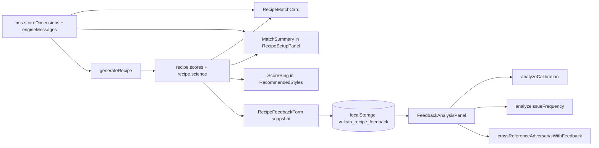

# Score e feedback utente
> Aggiornamento: 2026-07-01 | Stato: ✅ | File documentati: 5

## Sommario

Il motore (`pizza-engine.ts`) calcola `RecipeScores` (5 dimensioni + composite) e `ScientificLayer` dentro `GeneratedRecipe`. Questo capitolo copre **solo la UI** e la **persistenza feedback** post-cottura: card match, anello compatto, form utente e Engine Lab per calibrazione.

Integrazione: `recipe.tsx` e `home.tsx` montano `RecipeMatchCard`; `recipe.tsx` usa anche `MatchSummary` interno nell'header del pannello parametri; `recipe-output.tsx` monta `RecipeFeedbackForm` in fondo; `recommended-styles.tsx` usa `ScoreRing` sulle card stile.

## File chiave

| File | Ruolo |
|------|--------|
| `src/app/features/recipe/recipe-match-card.tsx` | 580 righe; card compatibilità/fattibilità con composite score, diagnosi del soffitto, pulsante ottimizza, e indicatori di tono estesi |
| `src/app/features/recipe/score-ring.tsx` | 71 righe; anello SVG compatto (score 0–100) per liste stili |
| `src/app/features/recipe/recipe-feedback.tsx` | 542 righe; form progressivo post-ricetta: tentativo, riuscita, dettagli opzionali, issues, note → `saveFeedback` |
| `src/app/features/recipe/feedback-store.ts` | 619 righe; tipi, `localStorage` (`vulcan_recipe_feedback`), analisi calibrazione, export/import CSV/JSON, `ADVERSARIAL_FINDINGS` |
| `src/app/features/recipe/feedback-analysis.tsx` | 544 righe; pannello DevTools (Engine Lab → Feedback): panoramica, issues, success per stile, audit adversarial |

**Motore (riferimento):** `SCORE_DIMENSIONS`, `calculate*Score`, `resolveEngineMsgs` in `pizza-engine.ts`.

## Flusso dati

1. **Score UI:** `GeneratedRecipe.scores` resta immutato dal parent; `RecipeMatchCard` mostra composite e assi principali, `MatchSummary` compatta il dato nell'header della modale parametri, `ScoreRing` resta per liste e card stile.
2. **Messaggi:** `scores.penalties`, `warnings`, `claims` sono chiavi template; `resolveEngineMsgs(..., cms.engineMessages)` produce testo localizzato per output e blocchi tecnici.
3. **Feedback:** flusso progressivo: domanda "hai provato?" → riuscita/fallita → submit rapido oppure form dettagliato. Il submit costruisce `RecipeSnapshot` + `PredictedScores` + ratings/issues → `saveFeedback` (max 500 entry, eviction metà se pieno).
4. **Calibrazione:** rating 1–5 scalato ×20; feasibility usa `(6 - difficulty) * 20`; minimo 3–5 campioni per verdetto.

## Funzioni principali

| Simbolo | File | Descrizione |
|---------|------|-------------|
| `RecipeMatchCard` | `recipe-match-card.tsx` | Card match: headline, stato forno, assi score e CTA reset se la ricetta è adattata |
| `matchTone` | `recipe-match-card.tsx` | Classifica composite score in tono positivo o warning per icone/copy |
| `MatchSummary` | `recipe.tsx` | Score compatto nell'header di `RecipeSetupPanel`, con assi estesi solo su desktop largo |
| `ScoreRing` | `score-ring.tsx` | Cerchio progress + testo centrale |
| `RecipeFeedbackForm` | `recipe-feedback.tsx` | Stato form + `handleSubmit` |
| `loadFeedback` / `saveFeedback` | `feedback-store.ts` | Caricamento e salvataggio dei feedback in localStorage |
| `analyzeCalibration` | `feedback-store.ts` | Bias e correlazione per dimensione |
| `analyzeIssueFrequency` | `feedback-store.ts` | Conteggio issue per stile/parametri medi |
| `analyzeStyleSuccessRate` | `feedback-store.ts` | Success rate e calibration gap per `styleId` |
| `crossReferenceAdversarialWithFeedback` | `feedback-store.ts` | Conferma finding ADV-02, ADV-07, ADV-08 da feedback |
| `FeedbackAnalysisPanel` | `feedback-analysis.tsx` | UI dev con export/import/clear |

## Costanti e configurazione

| Costante | Valore / ruolo |
|----------|----------------|
| `SCORE_DIMENSIONS` | 5 dimensioni: `authenticity`, `feasibility`, `digestibility`, `sustainability`, `experimentation` (colori e label nel motore) |
| `STORAGE_KEY` | `vulcan_recipe_feedback` |
| `MAX_ENTRIES` | 500 feedback |
| `RECIPE_ISSUES` | 14 issue (`overproofed`, `burnt_top`, `raw_center`, …) con `category` |
| `RECIPE_ISSUES[].correction` | Copy IT-only mostrato dopo submit per spiegare cosa verrebbe corretto "la prossima volta" |
| `ADVERSARIAL_FINDINGS` | 8 voci ADV-02 … ADV-12 documentate nel codice |
| Soglie calibrazione | `meanBias > 15` → overestimates; `< -15` → underestimates; `|r| < 0.3` → uncorrelated |
| Token CSS score | Colori asse da `SCORE_DIMENSIONS`; i blocchi UI usano token tema (`--text-accent`, `--text-warning`, `--container-*`) e token allineati per icone di stato (`--icon-success`, `--icon-accent`, `--icon-muted`) |

**Pesi score da CMS:** in `generateRecipe`, parent passa `scoreWeights` da `cms.scoreDimensions.*.weight` (recipe + home).

## Guard rail e vincoli

- `RecipeMatchCard` assume `scores` non null perché viene montata solo quando `recipe` esiste.
- Il lock scroll della modale parametri appartiene a `RecipeSetupPanel`, non più a una bottom sheet score separata.
- `MatchSummary` evita overflow: titolo e score sono in layout responsive, con assi dettagliati nascosti sotto `lg`.
- **Confronto a Due Livelli e Diagnostica Bottleneck**: `RecipeMatchCard` confronta il punteggio composite corrente con il soffitto teorico raggiungibile tramite ottimizzazione ($M_o$). Visualizza una linea diagnostica di avviso: se $M_o < 40$ segnala che la preparazione non è fattibile con quel setup (limite hard del forno); se il forno è un collo di bottiglia parziale ma consente una pizza ($M_o < 65$) mostra un compromesso onesto; se mancano ingredienti/lieviti in dispensa (vincoli soft) genera una lista della spesa; se c'è margine significativo ($\ge 8$ punti) consiglia l'ottimizzazione.
- **Pulsante e Rationale di Ottimizzazione**: Se abilitato e non già al soffitto, mostra il pulsante "Ottimizza per me +Δ" con la differenza di punti guadagnabili. In calce alla card viene renderizzato l'elenco dei passaggi e delle scelte prese dall'ottimizzatore (rationale).
- **Stati Tono e Icone Match**: Il tono del match mappa il punteggio su 5 icone e colori diversi: `HeartHandshake` ($\ge 90$), `Heart` ($75-89$), `HeartPulse` ($60-74$), `HeartCrack` ($< 60$ o low) e `HeartOff` per fallimento.
- **Loop di Apprendimento tramite Feedback (F2 e F3)**: La funzione `deriveFeedbackCorrections` in `feedback-store.ts` rileva problemi ricorrenti ($\ge 2$ tentativi falliti) sullo stesso stile. Propone all'utente correzioni concrete e trasparenti (+2% o -2% idratazione, moltiplicatore $\pm 20\%$ sulla durata della lievitazione e variazione di $\pm 0.2\%$ sul sale in caso di impasto troppo salato o insipido). Queste correzioni vengono proposte tramite la modale *"Ho imparato dai tuoi X tentativi"* su Home e dettaglio ricetta.
- **Accessibilità Score**: i pulsanti e toggle PizzaNerd vivono nei componenti ricetta/output e usano label descrittive; `ScoreRing` è SVG decorativo con valore testuale centrale.
- Feedback submit: il flusso base salva anche senza rating completo; il form dettagliato rende `overall` obbligatorio prima del submit.
- **Copy Feedback**: la CTA del form di feedback invita alla compilazione spiegando che il feedback "aiuta a migliorare la ricetta" (copy human-friendly, semplificato dal precedente "calibra il motore scientifico").
- **Correzioni deduplicate**: dopo l'invio, gli issue selezionati producono una lista deduplicata di correzioni (`RECIPE_ISSUES[].correction`) per dare valore immediato all'utente.
- `saveFeedback`: catch storage full → tiene metà più recente.
- `analyzeCalibration`: con `< 3` tentativi → `insufficient_data`.
- Feedback non invia dati al server — solo `localStorage` + export manuale dev.

## Bug noti e fix

| ID | Severità | Stato `fixed` in codice | Descrizione |
|----|----------|-------------------------|-------------|
| ADV-07 | bias | `false` | Asse `forma` in A-Score sempre 100 (+4–10 pt inflazione) |
| ADV-12 | noise | `false` | Compensazione olio su stili al burro (es. chicago_deep) |
| ADV-06 | bias | `false` | Sustainability: ovenEfficiency vs cook time incoerenti |
| ADV-02, ADV-05, ADV-08, ADV-11, ADV-04 | bug/bias | `true` | Fix applicati al motore; tracciati in `ADVERSARIAL_FINDINGS` |
| `recipe-feedback` ovenType | possibile imprecisione | — | Snapshot usa `recipe.style.baking.oven_type_required`, non `constraints.oven_type` utente |

**Nota:** calibrazione engine da feedback è **analitica offline** (DevTools), non modifica pesi a runtime. `score-dashboard.tsx` è stato rimosso nella pulizia dead code 2026-06-19; eventuali riferimenti vanno ricondotti a `RecipeMatchCard`, `ScoreRing` o ai blocchi nerd inline.
