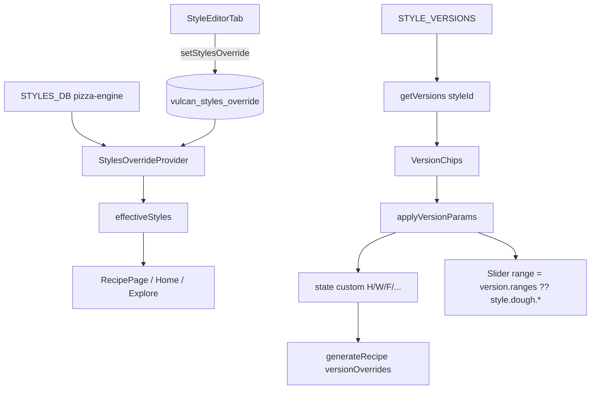

# Stili, versioni e override
> Aggiornamento: 2026-06-23 | Stato: ✅ | File documentati: 11

## Sommario

Gli **stili canonici** vivono in `STYLES_DB` (`pizza-engine.ts`, **28 stili**). Questo capitolo aggiunge:

- **Versioni interpretative** (`StyleVersion`) — preset parametri + range per slider/score, skill-aware. Ora supportano anche un blocco `ranges` specifico a livello di versione impasto (es. W farina e idratazione localizzati) che sovrascrive i range dello stile genitore.
- **Override runtime** — intero DB sostituibile via `localStorage` (editor dev).
- **UI scoperta stile** — raccomandazioni, sheet dettaglio, foto editoriali.

La versione attiva fluisce in `generateRecipe` come `versionOverrides` e nei range del configurator (Smart Link, adaptive hints, autenticità).

## File chiave

| File | Ruolo |
|------|--------|
| `src/app/components/style-versions.ts` | `STYLE_VERSIONS`, API `getVersions`, `getDefaultVersion`, `getVersionById` |
| `src/app/components/style-photos.ts` | Fonte canonica delle foto locali per 28 stili e dei 6 video hero serviti da `public/videos/` |
| `src/app/components/styles-override-context.tsx` | Provider React: `effectiveStyles = override ?? STYLES_DB`, persistenza `vulcan_styles_override` |
| `src/app/components/recommended-styles.tsx` | `recommendStyles` + filtri; re-export `STYLE_PHOTOS`; card con `ScoreRing` |
| `src/app/components/style-detail-sheet.tsx` | Bottom sheet portal: foto poster, video blur-in se disponibile, range stile, deviazione, parametriche, CTA genera |
| `src/app/pages/explore.tsx` | Route `/explore` (Tab Scopri): ricette iconiche, preferiti, filtri famiglia e catalogo completo 28 stili |
| `src/app/components/style-editor-tab.tsx` | DevTools: editor CRUD stili dev con componente `ImageInput` per caricamento/gestione file grafici locali (Base64) o URL esterni |
| `src/app/components/sync-tab.tsx` | Diff bundle sorgenti Vulcan Cloud ↔ locale (non modifica stili direttamente) |
| `src/app/components/interpretation-library.ts` | Database delle Interpretazioni d'Autore: 14 voci tra Maestri, Pizzerie, Community e Disciplinari con parameter overrides e narrativa |
| `src/app/components/signature-recipes.ts` | Database delle Ricette Iconiche: 12 combinazioni pre-impostate di Stile e Topping Concept collegate tramite deep-links URL (Sprint 12) |
| `src/app/components/tilt-card.tsx` | Componente UI per l'effetto di inclinazione 3D interattivo e riflesso speculare sensibile al puntatore del mouse delle card degli stili |

**Consumer principali:** `recipe.tsx`, `home.tsx`, `explore.tsx` (`useStylesOverride`); `recipe-configurator.tsx` (`getVersions`, range versione).

## Flusso dati

1. **Selezione versione:** `getDefaultVersion(styleId, skillLevel)` all’apertura; URL `?v=` su recipe page; chip chiamano `applyVersionParams`.
2. **Override motore:** `versionOverrides = { ...activeVersion.ranges, dough_weight_g? }` passato a `generateRecipe` → clone stile con range sostituiti (`versionRanges` in motore).
3. **Override DB:** `StyleEditorTab` clona mappa stili → `setStylesOverride` → tutte le pagine leggono `effectiveStyles`.

## Funzioni principali

| Simbolo | File | Descrizione |
|---------|------|-------------|
| `getVersions(styleId)` | `style-versions.ts` | `STYLE_VERSIONS[id] ?? []` |
| `getVersionById(id)` | `style-versions.ts` | Ricerca globale su tutti gli stili |
| `getDefaultVersion(styleId, skill)` | `style-versions.ts` | Match `skill_hint`; fallback distanza minima, preferisce livello inferiore |
| `applyVersionParams` | `recipe-configurator.tsx` | Scrive `version.params` nei setter |
| `useStylesOverride` | `styles-override-context.tsx` | Hook contesto |
| `StylesOverrideProvider` | `styles-override-context.tsx` | Load/save `localStorage` al mount |
| `recommendStyles` | `pizza-engine` via `recommended-styles.tsx` | Ranking stili vs `UserConstraints` |
| `StyleDetailSheet` | `style-detail-sheet.tsx` | Dettaglio + `onGenerate` (home wizard) |
| `StyleEditorTab` | `style-editor-tab.tsx` | CRUD stili dev (~1476+ righe) |
| `SyncTab` | `sync-tab.tsx` | `import.meta.glob` sorgenti, diff hash djb2, export bundle |

## Costanti e configurazione

| Costante | Dettaglio |
|----------|-----------|
| `STYLE_VERSIONS` | Record `styleId → StyleVersion[]` — versioni interpretative per gli stili supportati |
| `StyleVersion.skill_hint` | `SkillLevel` 1–4 per default automatico |
| `fermentation_temp_c` | Discreti: `4` (frigo), `12` (fresco), `22` (ambiente) |
| `dough_weight_g` | Opzionale — override peso teglia (es. Bonci Leggerissima 600 g, Sottile 600 g) |
| `STORAGE_KEY` override | `vulcan_styles_override` |
| `STYLE_PHOTOS` | **28 asset locali** in `src/assets/*.png` per `style.id`; fonte unica importata da `style-photos.ts` |
| `STYLE_VIDEOS` | **6 video** in `public/videos/` (`napoletana_stg`, `chicago_deep`, `detroit`, `new_york`, `focaccia_genovese`, `focaccia_barese`) usati nel detail sheet |
| `TIER_META` | `perfect` / `good` / … per sezioni raccomandazione |

**Stili senza versioni:** `getVersions` → `[]`; chip nascoste; range solo da `PizzaStyle.dough.*`.

## Guard rail e vincoli

- Override: oggetto vuoto o parse fallito → ignorato, si usa `STYLES_DB`.
- `getDefaultVersion`: senza versioni → `null`; recipe/home usano centro range stile.
- **Soglia idratazione skill-aware** (`recommended-styles.tsx`): il warning "idratazione impegnativa" si attiva a >70% per skill 1 (principiante) e >85% per skill 2 (intermedio); skill 3–4 non ricevono mai il warning. Prima era una soglia fissa >70% per tutti i livelli skill ≤ 2.
- Range versione **restringono** slider e penalità autenticità, non sostituiscono il record stile in `STYLES_DB`.
- `clearOverride` (home reset + dev) ripristina DB canonico.
- **Rendering Robusto Varianti Autore:** `StyleDetailSheet` effettua il rendering condizionale delle varianti d'autore (`compatVariants`) verificando se l'emoji associata è presente o meno (evitando spazi vuoti o gap grafici dovuti alla rimozione delle emoji dalle tabelle tassonomiche).
- **ImageInput in Dev**: Lo `StyleEditorTab` dispone del componente `ImageInput` che consente di caricare immagini dal disco (convertite in Base64 DataURL) o inserire URL Web, salvando il risultato in `style.image` per le card dello stile.
- **Media locali canonici**: `STYLE_PHOTOS` non deve più vivere duplicato in componenti UI; `recommended-styles.tsx` lo re-esporta solo per compatibilità. I video restano lazy via tag `<video>` e hanno fallback automatico alla foto poster.
- `StyleEditorTab` + live sync: ogni modifica può riscrivere `localStorage` — solo ambiente dev.
- `SyncTab` esclude `src/app/components/ui/` dal bundle.

## Integrazioni e Varianti d'Autore Implementate (Sprint 11)

Le seguenti varianti tecniche avanzate e stili con layout speciale sono stati integrati pienamente in `STYLE_VERSIONS` ed in `STYLES_DB`:
- **Pizza Baciata (`pizza_baciata`)**: Gestione geometrica dei panetti sdoppiati (2 panetti gemelli per unità) e timeline con step speciali per la stesura sovrapposta con spennellatura d'olio, cottura in bianco, sdoppiamento post-bake e farcitura a freddo.
- **Pizza Patate e Porchetta (`pizza_patate_porchetta`)**: Variante della Baciata con topping signature (`patate_porchetta`). Associa le fette sottilissime di patate cotte sopra l'impasto pre-bake e l'aggiunta di porchetta a crudo post-cottura all'apertura dello strato.
- **Ciaccino Senese (`ciaccino_senese`)**: Focaccia ripiena con layout `closed_stuffed`. Richiede due dischi sigillati con ripieno pre-bake e impasto caratteristico a base di strutto (`lard`).

## Sistema di Interpretazioni d'Autore (Sprint 12 Fase 4)

La libreria `interpretation-library.ts` (472 righe) introduce una ricca astrazione modulare sopra le versioni interpretative:
- **Quattro Categorie di Interpretazione**: Mappa le preparazioni secondo chi le ha codificate:
  - `disciplinare` (3): `avpn_disciplinare`, `igp_recco`, `apiter_teglia`.
  - `master` (8): `bonci_pizzarium`, `pepe_caiazzo`, `martucci_caserta`, `sorbillo_napoli`, `bosco_aria_di_pane`, `capuano_napoli`, `bianco_phoenix`, `forkish_portland`.
  - `pizzeria` (1): `da_michele_napoli`.
  - `community` (2): `malati_di_pizza`, `confraternita_pinsa`.
- **Parameter Overrides e Iniezione**: Consente ad ogni interpretazione di sovrascrivere selettivamente i parametri fisici dell'impasto (idratazione, W farina, P/L, ore e temperatura di fermentazione, uso di pre-fermento o override dell'impasto tramite `impasto_ref`).
- **Narrativa e Story Card**: Ogni interpretazione è corredata da dati storici, anno di codificazione, biografia, link al sito originale e una "firma tecnica" (es. descrizione stesura o dots geometrici post-cottura). La selezione UI attuale passa dal `PremiumSelect` dentro `RecipeSetupPanel`.
- **Relazione con Legacy**: Questa libreria rappresenta la nuova astrazione modulare che sostituisce e amplia la logica legacy di `AUTHOR_VARIANTS` precedentemente ospitata in `deviation-tags.ts`.
- **Pulizia dead code 2026-06-19**: il file `interpretation-chips.tsx` non è più presente; il dato resta canonico in `interpretation-library.ts`.

## Bug noti e fix

| Area | Nota |
|------|------|
| Versioni vs skill profilo | Se `skill_level` cambia dopo selezione, versione attiva non si riallinea automaticamente finché non si riseleziona stile o chip |
| `getVersionById` globale | ID versione deve essere univoco tra stili (es. `bonci_casalingo` vs altri) |
| Override + CMS | Override stili non sincronizza automaticamente testi CMS (`styleDescriptions`) |
| ADV-04 (poolish vs biga) | Fix motore: tipo pre-fermento da `process_type` — vedi `feedback-store` |
| Editor dev | Modifiche errate a `PizzaStyle` possono rompere `generateRecipe` senza validazione schema runtime |

**Integrazione recipe-flow:** documentata in [recipe-flow](../recipe-flow/README.md) (`RecipeSetupPanel`, `PremiumSelect`, `versionOverrides` in `useMemo`).

## Ricette Iconiche e Deep-Linking (Sprint 12 Fase 5)

La libreria `signature-recipes.ts` introduce il concetto di "Ricette Iconiche" per arricchire la scoperta culinaria dell'utente con combinazioni di grande impatto gastronomico:
- **Astrazione di Deep-Linking**: Sotto al cofano, le ricette iconiche non richiedono motori procedurali separati. Esse agiscono come deep-links intelligenti che reindirizzano l'utente alla pagina principale della ricetta dello stile genitore (`style_id`) iniettando automaticamente il condimento pre-selezionato tramite il parametro di query `?topping=<concept_id>`.
- **Interfaccia SignatureRecipe**: Mappa proprietà avanzate: nome, descrizione narrativa, emoji, eventuale override della fotografia di copertina (`photo`), stile di base, topping associato, famiglia cached e tag di occasione (es. `"street food"`, `"comfort"`).
- **12 Ricette Selezionate**: Il database pre-imposta 12 piatti iconici che rappresentano la tradizione e l'evoluzione della pizza italiana ed estera (es. *Margherita Verace AVPN*, *Patate e Porchetta alla Baciata*, *Mortazza alla Pala Romana*, *Scrocchiarella Boscaiola*, *Detroit Pepperoni*, *Focaccia di Recco col Formaggio IGP*).
- **API di Filtro e Lookup**: Fornisce helper ottimizzati per recuperare le ricette per famiglia (`getSignatureRecipesByFamily`) o tramite ricerca puntuale dell'ID (`getSignatureRecipeById`).

## Visual Depth & Interactive Tilt Card

Introdotta a giugno 2026 come firma estetica e visiva dell'applicazione, la `TiltCard` fornisce un effetto tridimensionale di profondità e interazione dinamica alle card degli stili all'interno del catalogo raccomandazioni (`recommended-styles.tsx`), così come alle card catalogo stili e ricette iconiche presenti nella pagina Scopri (`explore.tsx`).

### 1. Comportamento e Inclinazione 3D
Il componente racchiude il suo contenuto in un contenitore tridimensionale con una prospettiva fissa impostata a `perspective: 900` e sfrutta iMotionValue e useSpring di Framer Motion:
- **Calcolo del puntatore**: All'interazione del mouse/puntatore, ricava la posizione X/Y del cursore rispetto al centro geometrico della card (in una scala normalizzata da `-0.5` a `0.5`).
- **Inclinazione morbida**: Questi valori controllano la rotazione degli assi `rotateX` e `rotateY` con un'inclinazione controllata limitata a un massimo di **6 gradi** (`maxTilt = 6`), smorzata da uno spring configurato per elasticità (`stiffness: 260`, `damping: 22`, `mass: 0.6`).

### 2. Glare Speculare Caldo
Per simulare la rifrazione della luce e dare una sensazione premium di "fisicità":
- Viene renderizzato un overlay assoluto contenente un gradiente radiale a bagliore caldo (`rgba(255,214,170,0.16)`) sovrapposto alle foto editoriali.
- La posizione del gradiente (`glareX`, `glareY`) si sposta linearmente dall'asse 25% al 75% coordinandosi al movimento del mouse, mentre la sua opacità sfuma morbidamente a zero quando il puntatore lascia la card.

### 3. Accessibilità e Ottimizzazioni (a11y)
- **Dispositivi Touch**: L'inclinazione 3D e il riflesso glare vengono automaticamente ignorati per i puntatori di tipo `touch` per evitare comportamenti grafici erratici su schermi mobili.
- **Riduzione del Movimento**: Il componente si interfaccia con `useReducedMotion()`. Se l'utente ha impostato le preferenze di sistema per ridurre il movimento, l'inclinazione dinamica e il riflesso glare vengono disattivati, eseguendo il fallback a un contenitore `div` statico standard non animato.

## Media Locali e Video Hero

`style-photos.ts` è il registro visuale canonico. Importa 28 PNG da `src/assets/` e li espone come `STYLE_PHOTOS`, così Explore, Home, Recipe Detail e Recommended Styles usano le stesse immagini senza dipendere da URL remoti.

`STYLE_VIDEOS` abilita una transizione foto → video in `StyleDetailSheet`: il poster resta sempre visibile, mentre il video parte muted/looped/playsInline e sfuma sopra la foto solo per gli stili con asset curato. Gli altri stili mantengono la sola foto locale.
